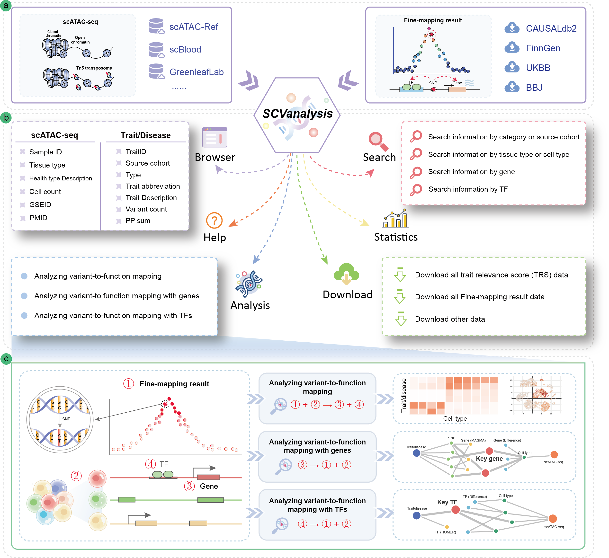

User Manual for scVMAP platform
==============================

 | scVMAP: https://bio.liclab.net/scvmap/
 | scVMAP tutorial: https://scvmap.readthedocs.io/en/latest/
 | scVMAP front-end: https://github.com/YuZhengM/scvmap_web
 | scVMAP back-end: https://github.com/YuZhengM/scvmap
 | scVMAP API: https://bio.liclab.net/scvmap_service/swagger-ui/index.html

A comprehensive platform for human **integrating** ``single-cell chromatin accessibility data`` with ``causal variants``.

