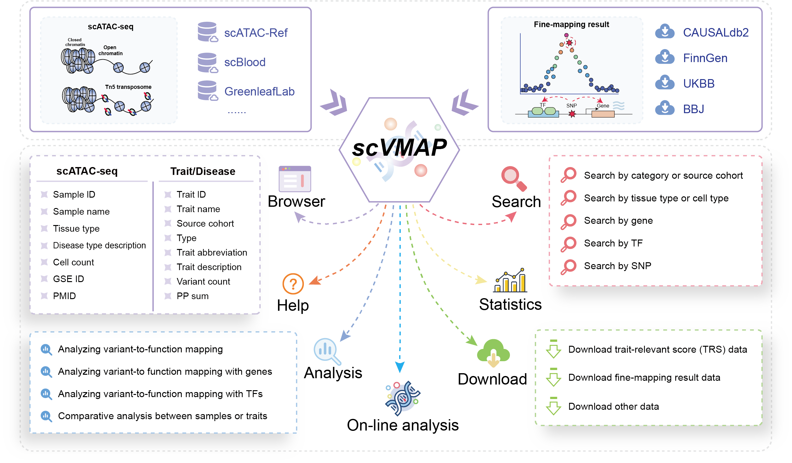

.. role:: text_red
   :class: red

.. raw:: html
   

User Manual for SCVdb platform
==============================

 | SCVdb: https://bio.liclab.net/scvdb/
 | SCVdb tutorial: https://scvdb-tutorial.readthedocs.io/en/latest/index.html

A comprehensive platform for human **integrating**
:text_red:`single-cell chromatin accessibility data` with
:text_red:`causal variant effects`.

