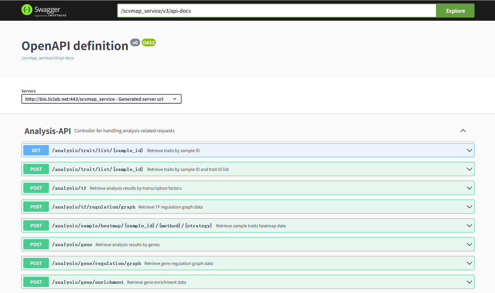

3. scVMAP API
===========================

 | scVMAP API: https://bio.liclab.net/scvmap_service/scvmap.html

`scVMAP <https://bio.liclab.net/scvmap/>`_ provides backend API interface information,
and researchers in need can obtain data directly through API interfaces.
The interface specifications follow `RESTful <http://www.restfulapi.nl/>`_ API standards,
and all returned data is in `JSON <https://www.w3schools.com/js/js_json_intro.asp>`_ format.

.. note::

    This API method is actually suitable for situations where you need to retrieve data related to a specific sample.
    For obtaining all the data, it is strongly not recommended to use API operations;
    instead, it is advised to download the data from the `Download <https://bio.liclab.net/scvmap/download>`_ page.

.. tip::

    Other websites or applications that embed scVMAP API development are most suitable.

We provide Python code to retrieve data from API interfaces.

.. code-block:: python
    :linenos:

    # -*- coding: UTF-8 -*-

    import time

    import pandas as pd
    import requests
    from requests import Response

    def get_result_data(resp: Response):
        json_data = resp.json()

        if json_data["status"]:
            return json_data["data"]

        raise ValueError(json_data["message"])

    if __name__ == '__main__':

        base_url: str = "https://bio.liclab.net/scvmap_service/"
        sample_id: str = "sample_id_1"
        trait_id: str = "trait_id_894"
        genome: str = "hg19"
        fine_mapping_method: str = "finemap"

        # Test
        response = requests.get(f"{base_url}/test")
        print(get_result_data(response))

        time.sleep(3)
        print("----------------------------------------------------------------------------------")

        # Variant information https://bio.liclab.net/scvmap_service/scvmap.html#/Detail-API/listTraitInfoData
        response = requests.post(
            f"{base_url}/detail/trait_info/{trait_id}/{genome}/{fine_mapping_method}",
            json={
                "page": 1,
                "size": 10,
                "field": "",
                "order": 0,
                "searchField": "",
                "content": "",
                "type": 1,
                "symbol": 1
            }
        )
        total_size = get_result_data(response)["total"]
        response = requests.post(
            f"{base_url}/detail/trait_info/{trait_id}/{genome}/{fine_mapping_method}",
            json={
                "page": 1,
                "size": total_size,
                "field": "",
                "order": 0,
                "searchField": "",
                "content": "",
                "type": 1,
                "symbol": 1
            }
        )
        variant_data = get_result_data(response)
        variant_df = pd.DataFrame(variant_data["data"])
        print(variant_df)

        time.sleep(3)
        print("----------------------------------------------------------------------------------")

        # MAGMA https://bio.liclab.net/scvmap_service/scvmap.html#/Detail-API/listMagmaGeneByTraitId
        response = requests.get(f"{base_url}/detail/magma_gene/{trait_id}/{genome}")
        magma_data = get_result_data(response)
        magma_df = pd.DataFrame(magma_data)
        print(magma_df)

.. code-block:: console
    :linenos:

    Connection test successful!
    ----------------------------------------------------------------------------------
               traitId     sourceId   chr  ... findex       pvalue              zscore
    0     trait_id_894  source_id_1  chr1  ...   1553  3.71279e-40  13.264584871821922
    1     trait_id_894  source_id_1  chr1  ...   1569  1.27087e-41  13.515227089114475
    2     trait_id_894  source_id_1  chr1  ...   1566  1.59038e-41  13.498714449933749
    3     trait_id_894  source_id_1  chr1  ...   1567   7.1796e-42  13.557193629064104
    4     trait_id_894  source_id_1  chr1  ...   1559  6.38263e-42  13.565799634934008
    ...            ...          ...   ...  ...    ...          ...                 ...
    2195  trait_id_894  source_id_1  chr9  ...    876  6.75943e-10   6.171597123541317
    2196  trait_id_894  source_id_1  chr9  ...    904  6.74388e-10   6.171967446066399
    2197  trait_id_894  source_id_1  chr9  ...    836  3.41044e-10   6.278847312864843
    2198  trait_id_894  source_id_1  chr9  ...    869  2.58988e-09   5.955671300308524
    2199  trait_id_894  source_id_1  chr9  ...    916  2.99909e-09   5.931628007804032

    [2200 rows x 19 columns]
    ----------------------------------------------------------------------------------
              traitId        gene chr  ...      pvalue  nsnps  zvalue
    0    trait_id_894       AAMDC  11  ...  3.2869e-07     32  4.9736
    1    trait_id_894     AFG3L1P  16  ...       5e-10      2  6.1094
    2    trait_id_894      ALOX12  17  ...  7.7875e-09      1  5.6551
    3    trait_id_894  ALOX12-AS1  17  ...  7.8535e-09      2  5.6537
    4    trait_id_894    ALOX12P2  17  ...  2.8279e-09      1  5.8266
    ..            ...         ...  ..  ...         ...    ...     ...
    180  trait_id_894   ZFHX4-AS1   8  ...  3.5305e-14     28  7.4867
    181  trait_id_894       ZFPM1  16  ...  1.0679e-12      9  7.0253
    182  trait_id_894      ZNF276  16  ...  8.5389e-17      1  8.2410
    183  trait_id_894      ZNF469  16  ...  4.9616e-07      1  4.8932
    184  trait_id_894      ZSWIM4  19  ...  1.9492e-08      2  5.4954

    [185 rows x 8 columns]

.. note::

    Do not access the API with long-term multi-threaded requests. If it affects the server's access speed or even impacts server operation, we will disable the IP address from which the access originates.
