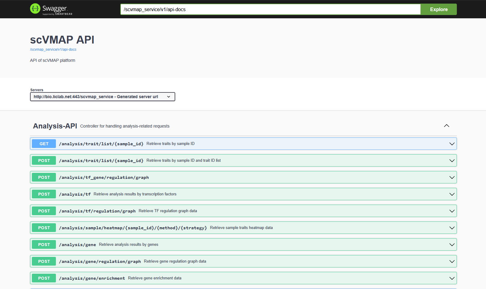

3. API
===========================

 | SCVdb API: https://bio.liclab.net/scvdb_service/swagger-ui/index.html

`SCVdb <https://bio.liclab.net/scvdb/>`_ provides backend API interface information,
and researchers in need can obtain data directly through API interfaces without using crawler strategies.
The interface specifications follow `RESTful <http://www.restfulapi.nl/>`_ API standards, and all returned data is in `JSON <https://www.w3schools.com/js/js_json_intro.asp>`_ format.

