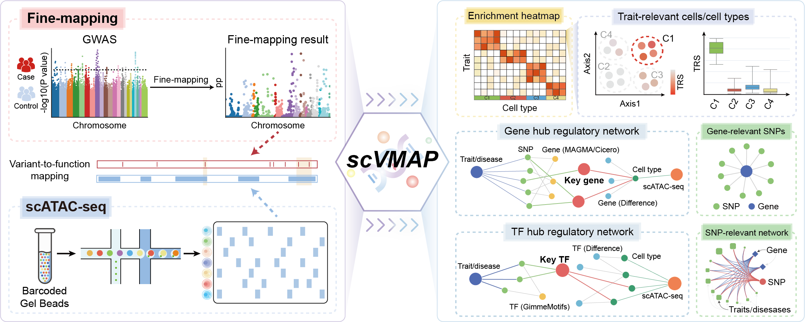

Welcome to scVMAP's documentation!
==================================

A comprehensive platform for **integrating** ``single-cell chromatin accessibility regions`` with ``causal variants``.

`scVMAP <https://doi.org/10.1093/nar/gkaf1112>`_ database access link: `https://bio.liclab.net/scvmap/ <https://bio.liclab.net/scvmap/>`_

scVMAP is a user-centric database that offers intuitive workflows, customizable parameters, and comprehensive data accessibility, featuring:

1. Integrates causal variants with chromatin accessibility regions at single-cell resolution.
2. Includes data from 183 scATAC-seq samples and 15,884 fine-mapping datasets.
3. Encompasses over 3,876,800 effective trait-sample pairs, 26.3 million trait-cell type pairs, and 32.1 billion trait-cell pairs.
4. Performs enrichment analysis for traits across specific cells or cell types.
5. Identifies relevant genes and transcription factors (TFs), and performs pathway enrichment analysis for these genes in the context of specific samples and traits.
6. Constructs an integrated regulatory network (variant-TF-gene) linking traits to samples.
7. Offers comprehensive resources for data download.
8. Makes the code for reproducing the database workflow publicly available.
9. Publishes the full-stack development code for the web application.
10. Provides API interfaces for programmatic data access.

Cite
--------

 | Zheng-Min Yu, Feng-Cui Qian, Qiao-Li Fang, Xiang-Yang Meng, Yan-Yu Li, Chen-Chen Feng, Li-Dong Li, Bing-Long Li, Yu-Rong Feng, Hui Jiang, Qiu-Yu Wang, Xuan Fan, Jin-Cheng Guo, Chun-Quan Li, scVMAP: a comprehensive platform for integrating single-cell chromatin accessibility regions with causal variants, Nucleic Acids Research, 2025;, gkaf1112, https://doi.org/10.1093/nar/gkaf1112

.. raw:: html

    

Contents
--------

.. toctree::
    :maxdepth: 3

   structure
   usage
   api
   implement
   problem
