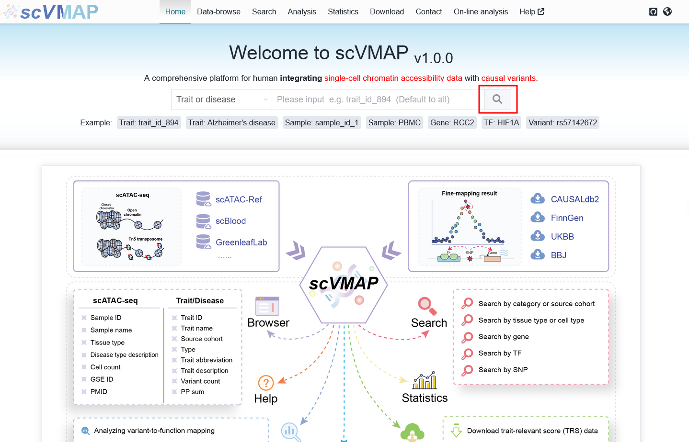

5. FAQ (Frequently Asked Questions)
===================================

Here we will answer common questions.

If you have any other questions that need to be answered, you can send an email to ``yuzmbio@163.com``.
Alternatively, you can ask questions on Github `scVMAP-reproducibility <https://github.com/YuZhengM/scvmap_reproducibility>`_.

5.1 Discovering issues on the website
----------------------------------------------

We have diligently completed the process of improving the website.

If you discover any issues or areas that need improvement, please contact us promptly. Thank you for your contribution.

.. note::

    If you find any minor issues that are inconvenient to disturb us, you can leave a message on `GitHub <https://github.com/YuZhengM/scvmap-tutorial>`_. Thank you for your effort and time.

5.2 There is a problem accessing the website
----------------------------------------------

Occasionally, we update information on the website, which may be due to conflicts between the previously cached data and newly published content.
Therefore, you need to ``clear the cache and access it again``.

.. note::

    The probability of this happening is relatively low. If clearing the cache does not solve the problem after it occurs, please contact us in a timely manner. Thank you for your contribution.

.. tip::

    If you have accessed the scVMAP database link before ``October 9, 2025``, it is recommended to clear the cache and access again.

5.3 Publicize front-end and back-end code
----------------------------------------------

 | scVMAP front-end: https://github.com/YuZhengM/scvmap_web
 | scVMAP back-end: https://github.com/YuZhengM/scvmap

We have released the full stack development code for the scVMAP database, which is very useful for bioinformatics database development.
Users can directly download and use them to develop bioinformatics database websites.

At least mastering ``Vue`` and ``Spring Boot`` frameworks is necessary to start practical application.

.. note::

    If you discover any unmodified privacy content, please contact us. We greatly appreciate your kindness.

5.4 Difficulties encountered in searching for trait or disease data
--------------------------------------------------------------------

Here, we mainly have three modules that provide search functionality:

    (1): ``Home`` search module,
    (2): ``Data-browse`` search module,
    (3): ``Search`` search module

The data returned by **Home** module contains significantly more columns than the data from **Data-browse** module.

.. note::

    The functionality to perform a fuzzy search using a trait name is limited to the **Home** and **Data-browse** modules.

The **Search** module is designed for professionals who are familiar with disease categories, enabling them to look up specific disease information based on this classification.

.. tip::

    **Recommended user search workflow**: On the `homepage <https://bio.liclab.net/scvmap/>`_, click the search button with an empty query to view all available data. Then, use custom filters on the columns of your choice to narrow down the results.

.. image:: ./img/faq/trait_search.png
