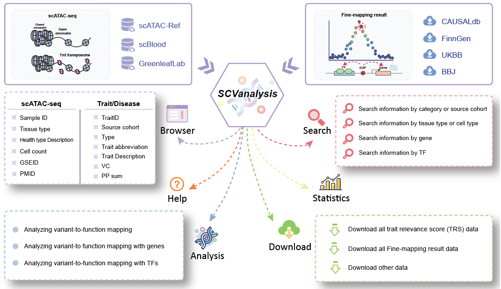

2. Analysis process and plat structure
======================================

The current version of SCVdb records ``183`` scATAC-seq data and ``15,805`` fine-mapping result data.
The scATAC-seq samples were organized and manually classified by scATAC-Ref, scBlood and others.
By using a unified system environment and software for unified process preprocessing, causal variant
data is collected from sources CAUSALdb, FinnGen, UKBB, and BBJ and processed and screened according
to unified principles. Among these, the single-cell data collection includes 20 tissue types, over
150 cell types, and a total of more than ``1,341,000`` single cells. The traits or disease types included
in the fine-mapping result datasets are diverse and cover a wide range, encompassing `all 22 major
disease categories` in the ICD-10 disease classification, with the II Neoplasms (C00-D48) being the
most prevalent, totaling 630. There are over 350 subtypes of diseases under the 22 disease categories.
Additionally, various indicators, treatments, compounds, drugs, occupation, and medical conditions are
also included. In the result datasets, the number of valid trait- or disease-scATAC-seq data pairs
exceeds ``1,923,000``, among which the number of trait- or disease-cell pairs is as high as ``15.9 billion``,
providing valuable resources for exploring the functional localization of single-cell variations. SCVdb
provides a user-friendly interface for analyzing, querying, browsing, and downloading pages, as well as
their related annotation information. For more detailed statistical data, please refer to the
"`Statistics <https://bio.liclab.net/scvdb/statistics>`_" page.

The results page displays a summary table of relevant traits with key details. When selecting a specific trait,
the detail information at the single cell level will be present, including the following contents:

(i). ``"Overview"``: For the single-cell sample detail page, it displays the detailed content of the sample,
the cell type distribution chart. For the trait or disease detail page, it displays the detailed content of
this fine-mapping result, including chromatin distribution maps and detailed causal variant information under
different reference genome backgrounds.
(ii). ``"Enriched Cells"``: It presents a table and corresponding visualization of enriched single-cell data.
For this trait, scatter plots and a box plot illustrate the potential regulatory effect on various cell types.
(iii). ``"Differential genes"``: It displays a data table of differentially expressed genes (based on gene
activity score from scATAC-seq data) between cell types, along with bubble charts depicting pathway and GO
term enrichment analysis results.
(iv). ``"Genes associated with enriched trait"``: For the given traits, we performed MAGMA gene-level analysis,
followed by pathway and GO enrichment analysis of significantly associated genes, with the results visualized
using bubble plots.
(v). ``"Gene hub network"``: To systematically investigate the association mechanisms between target traits and
specific cell types, we integrated data from two key dimensions: the genetic variation dimension
(trait-SNP-effect gene association data) and the cell-type-specific dimension
(sample-cell type-differential gene), to construct a trait-cell type association network. This network helps
reveal the multi-level regulatory paths through which traits influence cell types and identifies core gene sets.
(vi). ``"Differential TFs"``: It displays a data table of differential TFs between cell types.
(vii). ``"TFs associated with enriched trait"``: It displays the results of TF enrichment analysis for this trait using HOMER.
(viii). ``"TF hub network"``: Similar to panel **"Gene hub network"**, this panel constructs a network graph from
trait to cell type to identify key TFs involved in the regulatory process.
(iX). ``"Enrichment heatmap"``: Enrichment heatmap of different cell types in traits or diseases in a single-cell sample.

