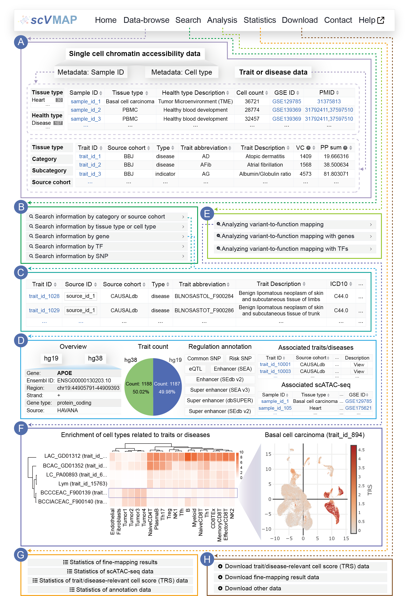

2.	scVMAP usage
=========================

Below, we will explain how to use the `scVMAP <https://bio.liclab.net/scvmap/>`_ (https://bio.liclab.net/scvmap/) platform based on
the different functional levels on the navigation bar.

:A: An interface for efficient browsing of both scATAC-seq data and fine-mapping results.

:B: Five search modes are provided.

:C: Retrieve result information through panel "Search information by category or source cohort".

:D: Retrieve result information through panel "Search information by gene".

:E: Three online analysis tools are provided.

:F: The result information obtained through the "Analyzing variant-to-function mapping" analysis tool.

:G: Statistical information.

:H: scVMAP provides a comprehensive collection of downloadable data.

------------

The detailed manual is as follows:

.. toctree::

    usage/home
    usage/dataBrowse
    usage/search
    usage/detail
    usage/analysis
    usage/statistics
    usage/download
    usage/contact
