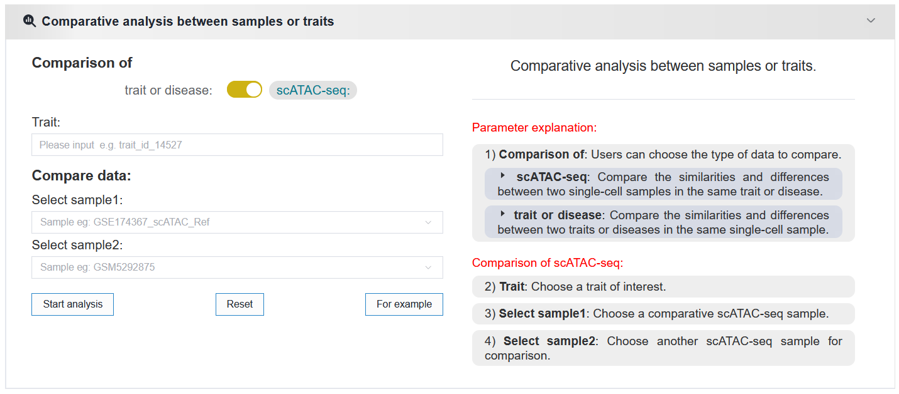
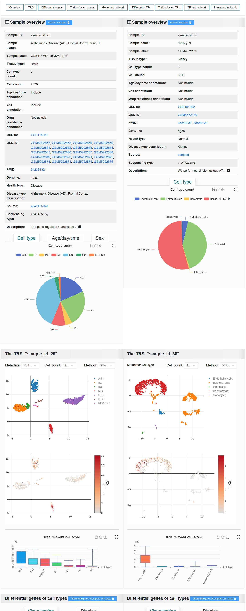

2.5.4 Comparative analysis between samples or traits
====================================================

 | Link: https://bio.liclab.net/scvmap/analysis

Users can compare the similarities and differences between traits within the same single-cell sample, as well as between different single-cell samples for the same trait.

Result:

