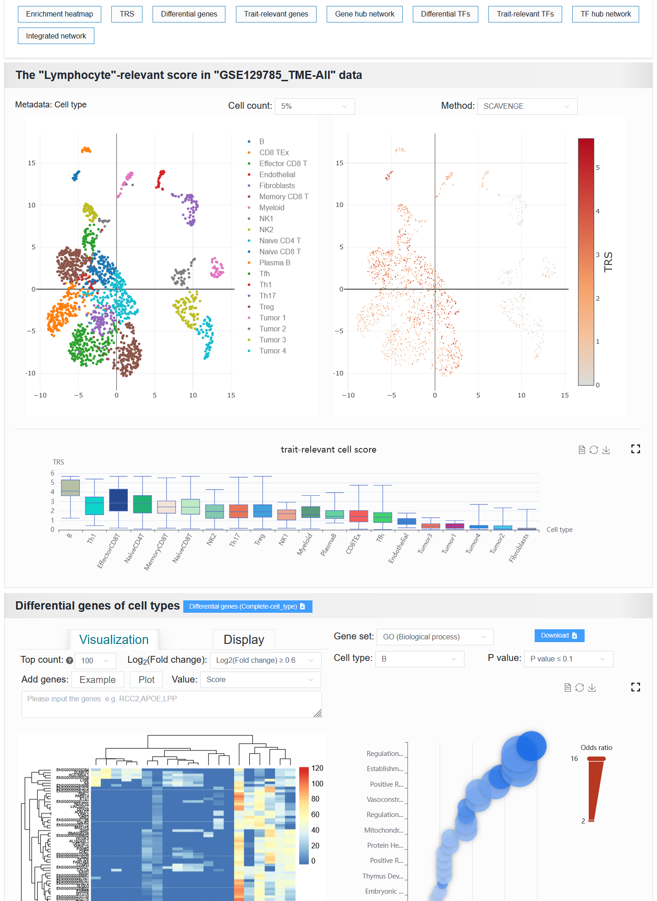

2.5.1 Analyzing variant-to-function mapping
============================================

 | Link: https://bio.liclab.net/scvdb/analysis

The user submits a scATAC-seq sample, and selects multiple causal variant data related to this single-cell sample. Upon initiating the analysis, the returned results consist of eight items.

The returned results consist of eight items, each corresponding to its own abbreviation. Clicking the abbreviation button will assign it to the corresponding position.

``Enrichment heatmap``: Enrichment of multiple traits or diseases into cell types of interest.

When clicking different traits or diseases, most of the following seven panels will change, which is the same as the content of the details page.

You can view the help document of the details page: `https://scvdb-tutorial.readthedocs.io/en/latest/usage/detail.html <https://scvdb-tutorial.readthedocs.io/en/latest/usage/detail.html>`_

