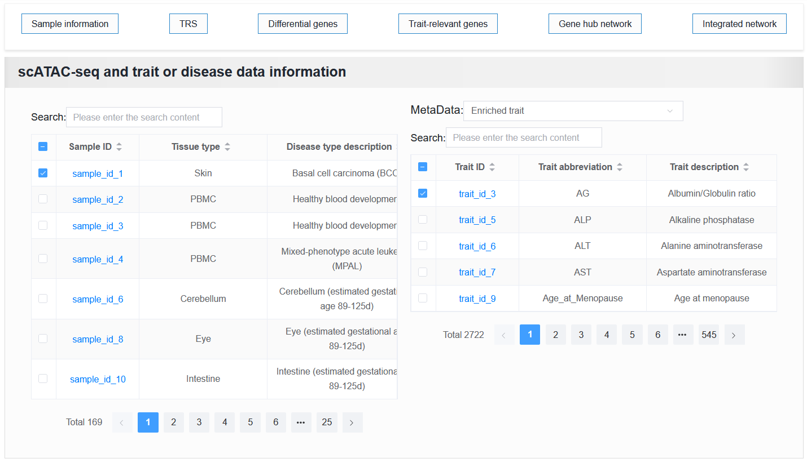

3.5.2 Analyzing variant-to-function mapping with genes
=======================================================

 | Link: https://bio.liclab.net/scvdb/analysis

Users submit genes of interest and set thresholds related to differential genes in scATAC-seq samples, as well as thresholds for traits or diseases enriched in genes through MAGMA.

.. image:: ../../img/analysis/analysis_gene.png

The returned result consists of five parts, each corresponding to its own abbreviation. The last four are included on the first analysis results page.

Click the abbreviation button to assign it to the corresponding position.

On the left is the scATAC-seq sample information contained in the strategy genes among the differential genes.

On the right is the trait or disease information contained in the strategy genes in the enriched genes.

When clicking on different samples above, the following four panels also change accordingly, which is the same as the content of "Enriched cells", "Differential genes", "Genes with enriched trait", and "Gene hub network" on the detailed information page.

You can view the help document of the details page: https://scvdb-tutorial.readthedocs.io/en/latest/usage/detail.html#

.. image:: ../../img/analysis/analysis_gene_result.png
