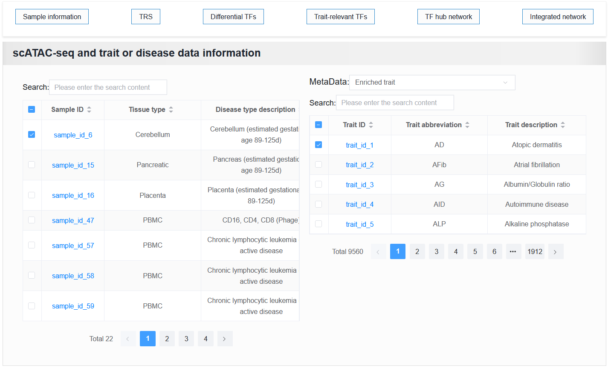
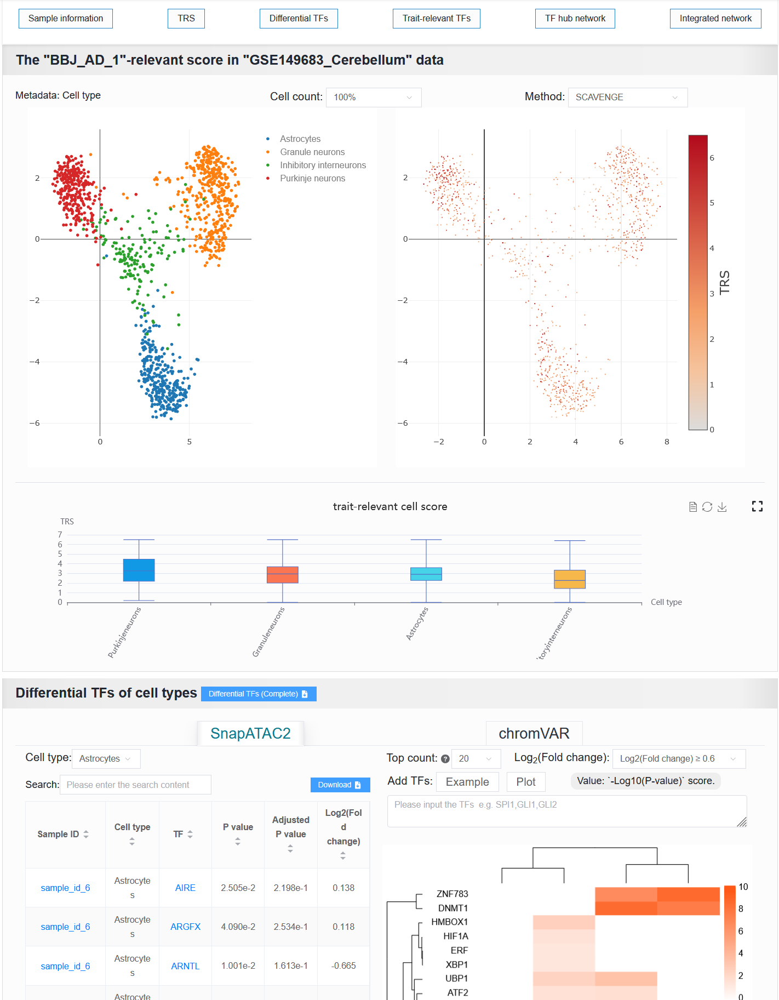

2.5.2 Analyzing variant-to-function mapping with TFs
=======================================================

 | Link: https://bio.liclab.net/scvdb/analysis

Users submit TFs of interest and set thresholds related to differential TFs in scATAC-seq samples, as well as thresholds for identifying TFs related to traits or diseases through HOMER.

The returned result consists of five parts, each corresponding to its own abbreviation. The last four are included on the first analysis results page.

Click the abbreviation button to assign it to the corresponding position.

On the left is the scATAC-seq sample information contained in the strategy TFs among the differential TFs.

On the right is the trait or disease information contained in the strategy TFs identified in TFs.

When clicking on different samples above, the following four panels also change accordingly, which is the same as the content of "Enriched cells", "Differential TFs", "TFs with enriched trait", and "TF hub network" on the detailed information page.

Help document for users to view detail pages: `https://scvdb-tutorial.readthedocs.io/en/latest/usage/detail.html <https://scvdb-tutorial.readthedocs.io/en/latest/usage/detail.html>`_

