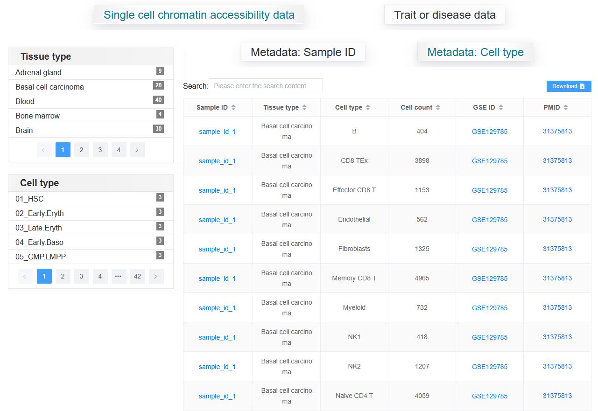
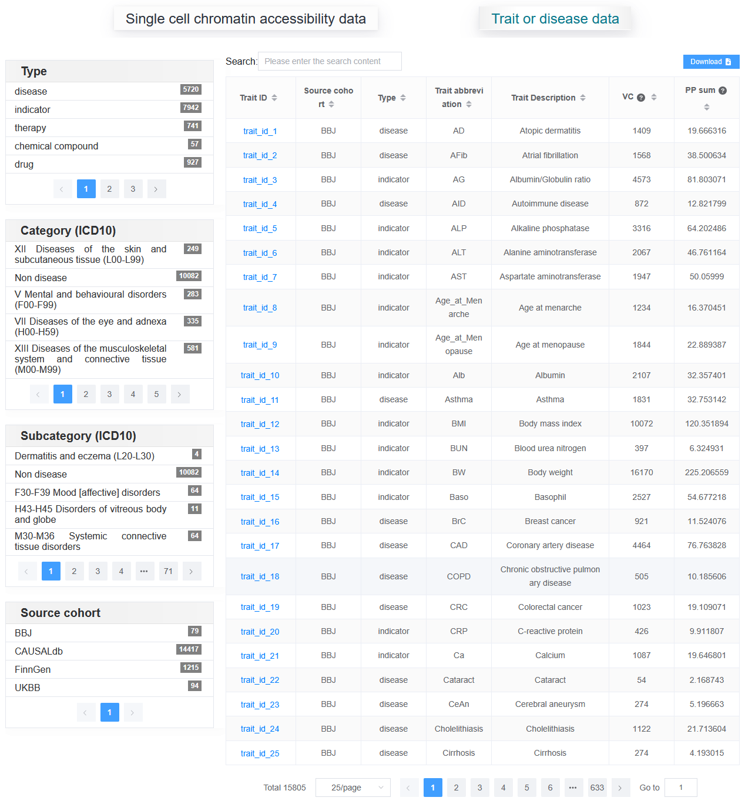

3.2 Data-browse
================

The "Data-browse" page of SCVdb provides users with options for single-cell samples and traits or diseases to access detailed data. Single cell datasets are further divided into sample or cell type based access data.

The displayed information content supports interactive tables, alphabetical sorting, and can be searched for the desired records using Search. After the user clicks on the "Sample ID" or "Trait ID" of interest, detailed information will be displayed on the new webpage.

3.2.1 Single cell chromatin accessibility data:
************************************************

We provide filtering based on "Tissue type" and "Health type" using samples as the metadata.

.. image:: dataBrowse/help_data_browse1.png

We provide filtering based on "Tissue type" and "cell type" using cell type as the metadata.

3.2.2 Trait or disease data:
************************************************

Similarly, fine mapping result data can be filtered using "Type", "Category (ICD10)", "Subcategory (ICD10)",and "Source cohort".

