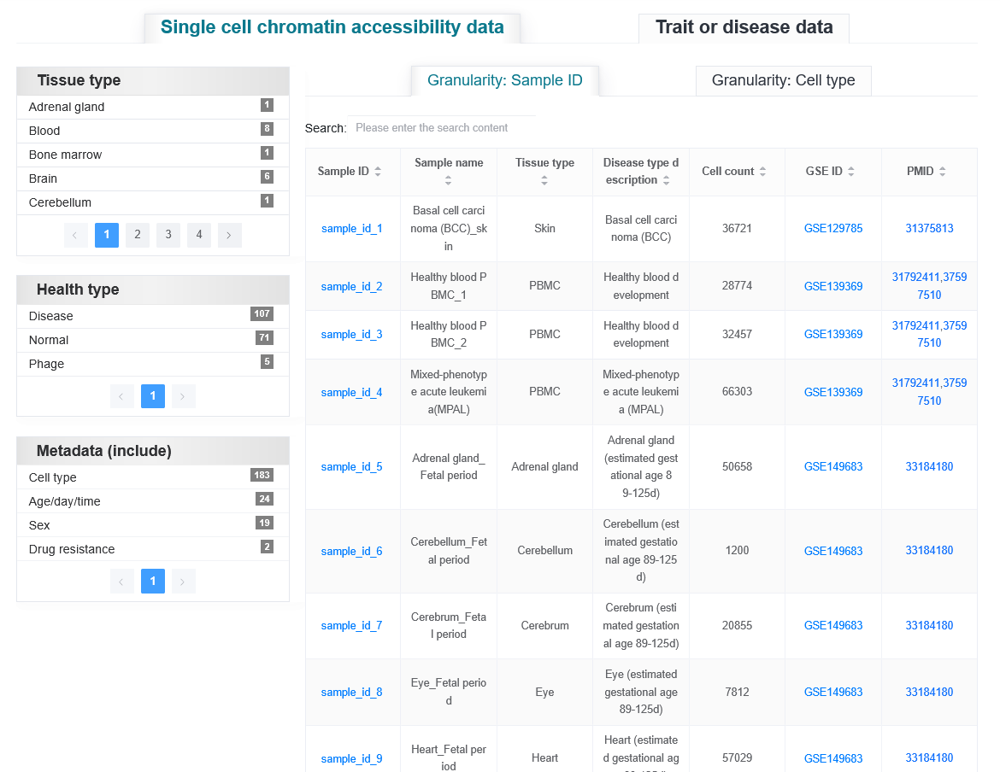
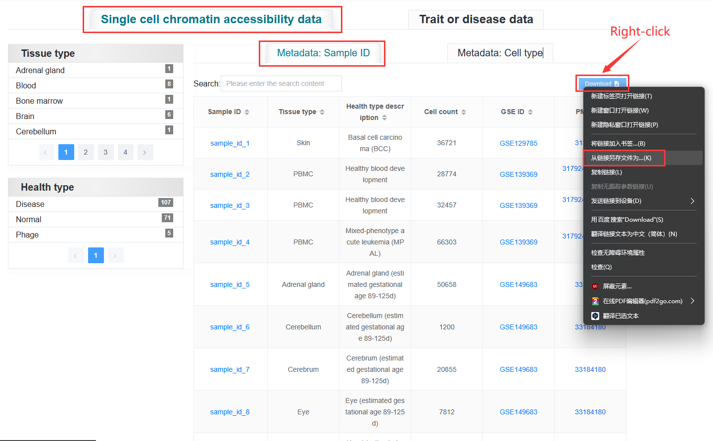
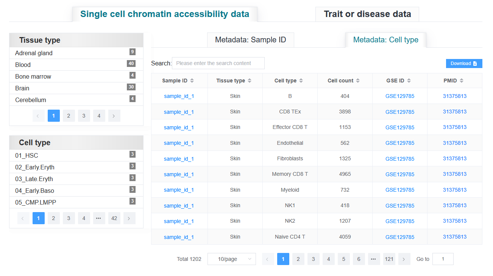
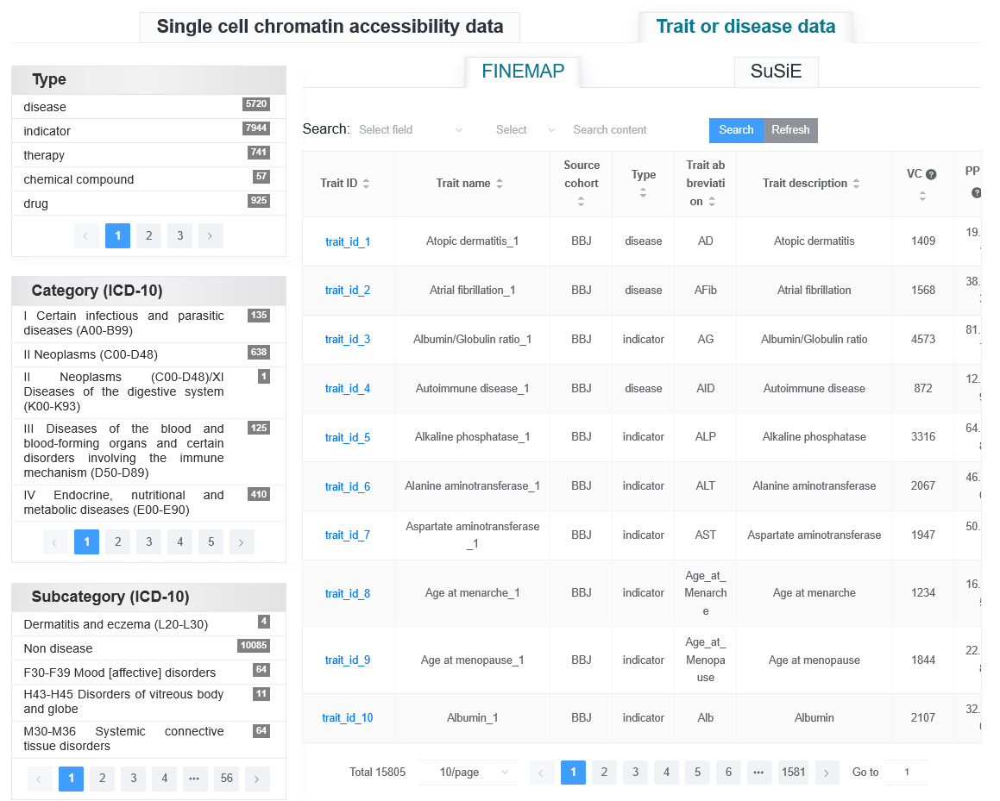

2.2 Data-browse
================

 | Link: https://bio.liclab.net/scvmap/data_browse

The "Data-browse" page of `scVMAP <https://bio.liclab.net/scvmap/>`_ provides users with options for single-cell samples and traits or diseases to access detailed data.

The displayed information content supports interactive tables, alphabetical sorting, and can be searched for the desired records using Search. After the user clicks on the "Sample ID" or "Trait ID" of interest, detailed information will be displayed on the new webpage.

.. note::

    We provide table downloads.

2.2.1 Single cell chromatin accessibility data
^^^^^^^^^^^^^^^^^^^^^^^^^^^^^^^^^^^^^^^^^^^^^^^^

Single cell datasets are further divided into **sample** or **cell type** based access data. Click on the ``Sample ID`` to enter the sample detail page.

2.2.1.1 Metadata: Sample ID
******************************

We provide filtering based on "Tissue type" and "Health type" using samples as the metadata.

.. note::

    When downloading files, some browsers will directly open the ``txt`` file and need to save the file by right-click.

2.2.1.2 Metadata: Cell type
******************************

We provide filtering based on "Tissue type" and "cell type" using cell type as the metadata.

2.2.2 Trait or disease data
^^^^^^^^^^^^^^^^^^^^^^^^^^^^^^^^^^^^^^^^^^^^^^^^

Similarly, fine mapping result data can be filtered using "Type", "Category (ICD-10)", "Subcategory (ICD-10)",and "Source cohort". Click on the ``Trait ID`` to enter the trait or disease detail page.

.. note::

    The first step is to select the column that needs to be searched, then you can choose the search mode, add the search content, and click the ``Search`` button to get the search results. Click button ``Refresh`` to obtain the original table without any retrieved information.
