2.4 Detail
================

Access to the details page through the "`Data-browse <https://bio.liclab.net/scvmap/data_browse>`_" page or search results page, etc.

For example:

1. Basal cell carcinoma (BCC):
 | For a trait or disease example: https://bio.liclab.net/scvmap/detail?traitId=trait_id_894
 | For a scATAC-seq example: https://bio.liclab.net/scvmap/detail?sampleId=sample_id_1

2. Alzheimer's disease (AD):
 | For a trait or disease example: https://bio.liclab.net/scvmap/detail?traitId=trait_id_14530
 | For a scATAC-seq example: https://bio.liclab.net/scvmap/detail?sampleId=sample_id_20

We provide eight content panels for users to analyze data. You can quickly locate the designated panel by clicking on the button of the corresponding module.

2.4.1 Overview
^^^^^^^^^^^^^^^^^^^^^^^^^^^^^^^

Described the basic information content of the sample, as well as the basic statistical information.

2.4.1.1 scATAC-seq
*******************************

The basic information of the scATAC-seq sample is displayed on the left.
The "Sample ID" is a unique identifier. The "Sample name" is a unique identifier with readability. "Sample label" is a unique identifier that contains sample information.

We provide scATAC-seq data samples for download as H5ad files processed by `SnapATAC2 <https://scverse.org/SnapATAC2/>`_.

For example: `https://bio.liclab.net/scvmap/detail?sampleId=sample_id_1 <https://bio.liclab.net/scvmap/detail?sampleId=sample_id_1>`_

.. image:: ../img/detail/sample_overview.png

.. note::

    The ``Source`` field provides a link to the original source of the data, and the page redirected by this link may not be accessible.

The proportion of metadata (cell types, age, sex, and drug resistance) in the scATAC-seq sample is shown on the right.

For example: `https://bio.liclab.net/scvmap/detail?sampleId=sample_id_20 <https://bio.liclab.net/scvmap/detail?sampleId=sample_id_20>`_

2.4.1.2 Fine-mapping result
*******************************

The left side displays basic information about the trait or disease.
The "Trait ID" is a unique identifier. The "Trait name" is a unique identifier with readability. The "Trait label" is a unique identifier that contains trait or disease information.

The right side displays the proportion of chromosomes and detailed causal variant information in the trait or disease.

We provide the download of this fine-mapping result.

For example: `https://bio.liclab.net/scvmap/detail?traitId=trait_id_55 <https://bio.liclab.net/scvmap/detail?traitId=trait_id_55>`_

``FINEMAP``

``SuSiE``: The red box highlights the differences from the FINEMAP method.

.. note::

    Only traits with IDs from 1 to 79 (trait_id_1-79, BJJ) have SuSiE results. For all other traits, the "Overview" displays FINEMAP information.

For example: `https://bio.liclab.net/scvmap/detail?traitId=trait_id_894 <https://bio.liclab.net/scvmap/detail?traitId=trait_id_894>`_

.. image:: ../img/detail/trait_overview.png

Click on the ``Source ID`` field value, and the page will pop up displaying detailed information about the source of the collected data.

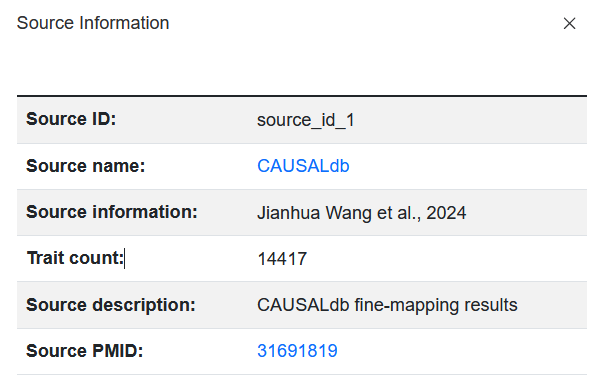

.. note::

    The ``Source name`` field provides a link to the original source of the data, and the page redirected by this link may not be accessible.

.. note::

    Among these, six fields (`Type`, `ICD-10`, `Category`, `Subcategory`, `Three category`) were manually added. There is a very small probability of misclassification. If you find any, please inform us at ``yuzmbio@163.com``. Thank you very much for your contribution.

2.4.2 TRS
^^^^^^^^^^^^^^^^^^^^^^^^^^^^^^^

We provide two parts, the first part is to display the information of sample enrichment, and the second part is to select a certain enriched sample and visualize the enrichment effect.

.. note::

    The first part will display different data types (scATAC-seq samples or fine-mapping results). The second part shows the exact same situation. Regardless of whether the user is viewing the detailed page of the scATAC-seq sample or the fine-mapping result, the six panels at the back display the same process content.

2.4.1.1 The first part
*******************************

For example: `https://bio.liclab.net/scvmap/detail?sampleId=sample_id_1 <https://bio.liclab.net/scvmap/detail?sampleId=sample_id_1>`_

scATAC-seq sample:
 | The table on the left displays the traits or diseases enriched with this single-cell sample. The right side visualizes the proportion of enrichment.

For example:

Default (trait_id_1 + FINEMAP)

Click SuSiE

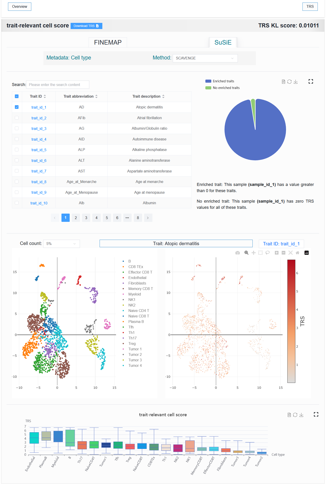

Select trait_id_894

For example: `https://bio.liclab.net/scvmap/detail?sampleId=sample_id_20 <https://bio.liclab.net/scvmap/detail?sampleId=sample_id_20>`_

Select trait_id_14530

.. note::

    When a trait with SuSiE methods (trait_id_1-79) is selected, results from both methods are available for display. However, when SuSiE is selected, only the results from the TRS module can be displayed.

Here, users can select ``metadata`` for cell annotation and choose different integration ``methods``.

These two options affect different scopes.

1. The ``Metadata`` option affects the ``TRS``, ``Differential genes``, ``Trait-relevant genes``, and ``Gene hub network`` modules. Selecting different metadata (cell type, age, sex, or drug resistance) allows for the exploration of V2G differences under the corresponding metadata.
#. The ``Method`` option affects only the ``TRS`` module.

.. note::

    Within the ``Metadata`` options, only ``cell type`` is supported for all modules. All other metadata types are supported exclusively for the TRS, Differential genes, Trait-relevant genes, and Gene hub network modules.

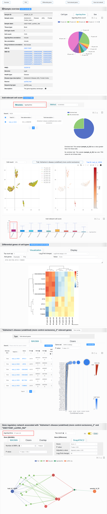

It is readily observable from the UMAP clustering plot that for age and gender, the intra-class distances are not compact and the inter-class distances are not separated. Neither the SCAVENGE results nor the differential analysis results show any highly significant differences between the age or gender groups. However, they possess potential reference value.

For example: `https://bio.liclab.net/scvmap/detail?traitId=trait_id_14530 <https://bio.liclab.net/scvmap/detail?traitId=trait_id_14530>`_

Fine-mapping result:
 | On the left is a table of single-cell samples associated with this trait or disease. The right side visualizes the proportion of enrichment.

2.4.1.2 The second part
*******************************

Visualize the enrichment of a trait or disease in a single-cell sample.

For example: BCC (sample_id_1 + trait_id_894)

For example: AD (sample_id_20 + trait_id_14530)

.. note::

    Users can select different numbers of cells for visualization. When the number of cells is too high, especially when the computer memory used by the user is relatively small, the browser may experience lag or even crash when loading data. In my experience, 40% or 50% could potentially represent the trend of all cells.

2.4.3 Differential genes
^^^^^^^^^^^^^^^^^^^^^^^^^^^^^^^

The content displayed in this module will vary depending on the selected metadata.

1. Cell type:

It displays a heatmap and a data table of differentially active genes between cell types, as well as a bubble plot showing the results of the gene pathway enrichment analysis.

For example: BCC (sample_id_1 + trait_id_894)

Click the ``Top count`` option and set it to ``5``, select ``Log2(Fold change)`` to be ``≥ 6``, then click ``Example``, and finally click the ``Plot`` button.
Once the process is complete, a differentially active gene heatmap for the BCC case will be generated, replicating the analysis from the article.

For example: AD (sample_id_20 + trait_id_14530)

Click the ``Top count`` option and set it to ``5``, select ``Log2(Fold change)`` to be ``≥ 0.9``, then input ``APOE, NECTIN2, APOC1, TOMM40``, and finally click the ``Plot`` button.
Once the process is complete, a differentially active gene heatmap for the AD case will be generated, replicating the analysis from the article.

Value: ``Score``

Value: ``Log2(Fold change)``

2. Other metadata:

It displays a heatmap and a data table of differentially active genes between cell types.

For example: AD (sample_id_20 + trait_id_14530)

.. note::

    Gene pathway enrichment analysis is not supported for metadata other than cell type.

2.4.4 Trait-relevant genes
^^^^^^^^^^^^^^^^^^^^^^^^^^^^^^^

Users can select either the trait-relevant gene results or the V2G annotation information.

2.4.4.1 Type: Trait-relevant genes
""""""""""""""""""""""""""""""""""""

For a selected trait, scVMAP displays:

1. ``MAGMA``: A table of gene-level analysis results from LD-based MAGMA and a bubble plot showing the results of the gene pathway enrichment analysis for the genes associated with the LD-based MAGMA analysis.
#. ``Cicero``: A table of gene-level analysis results from ATAC-based Cicero.

For example: BCC (sample_id_1 + trait_id_894)

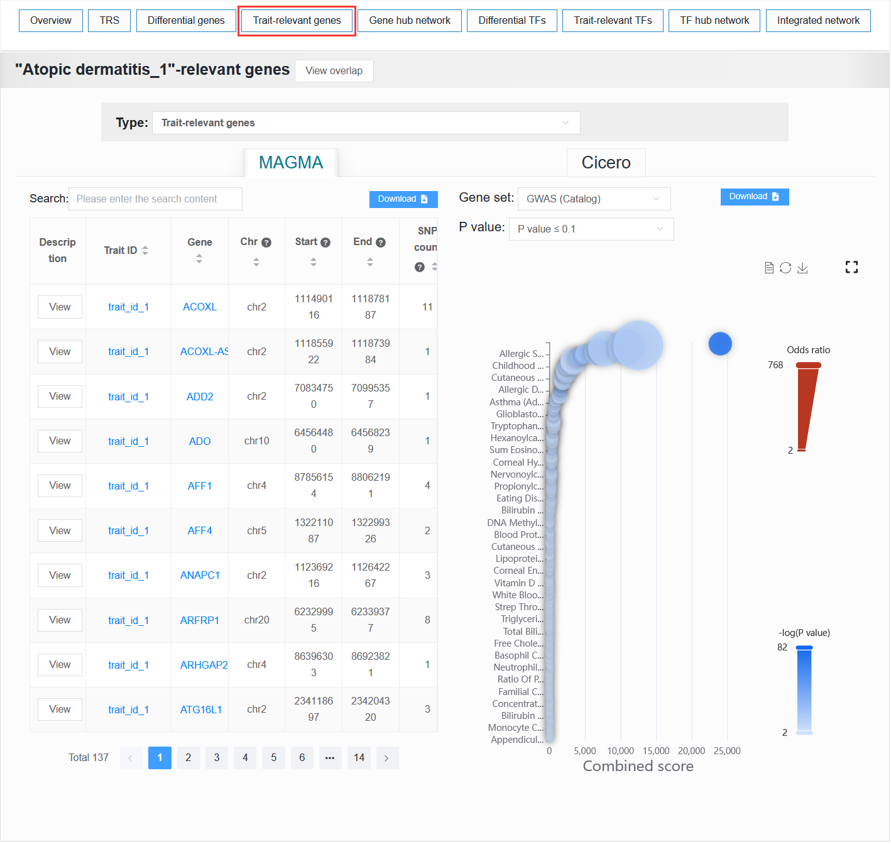

In gene set enrichment analysis, setting the ``P value`` to ``≤ 1.0E-6`` allows for the reproduction of the results for the BCC case study presented in the paper.

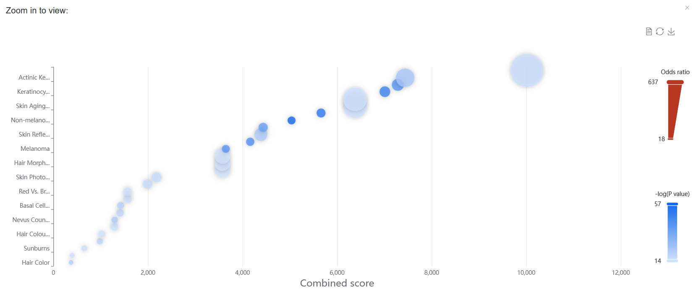

Enter ``RCC2``, then click the ``View`` button to see detailed variant information associated with this gene.

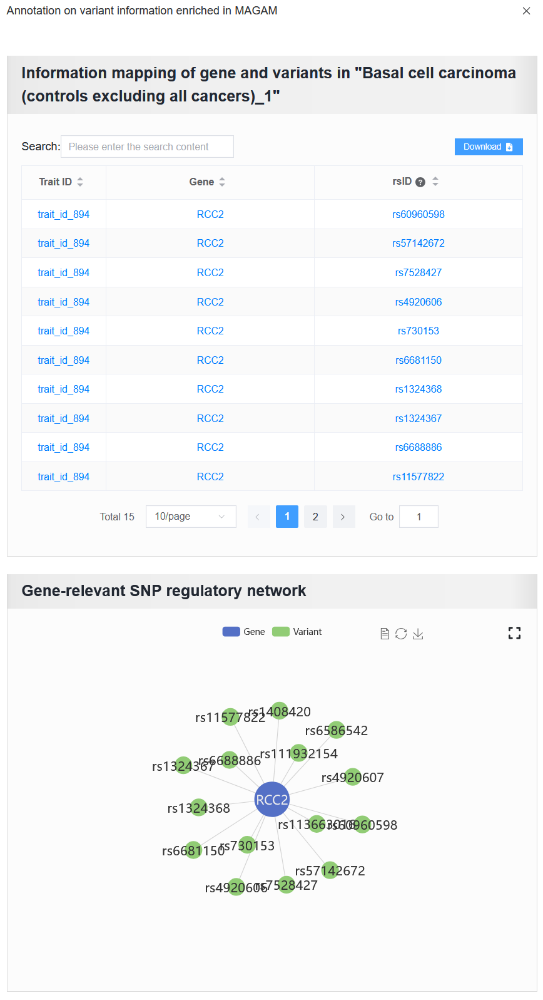

For example: AD (sample_id_20 + trait_id_14530)

Clicking the "View overlap" button displays the overlap between the gene sets derived from the selected trait (e.g. trait_id_14530) through ATAC-based Cicero and LD-MAGMA analyses. (The reproduction of the results for the AD case study presented in the paper.)

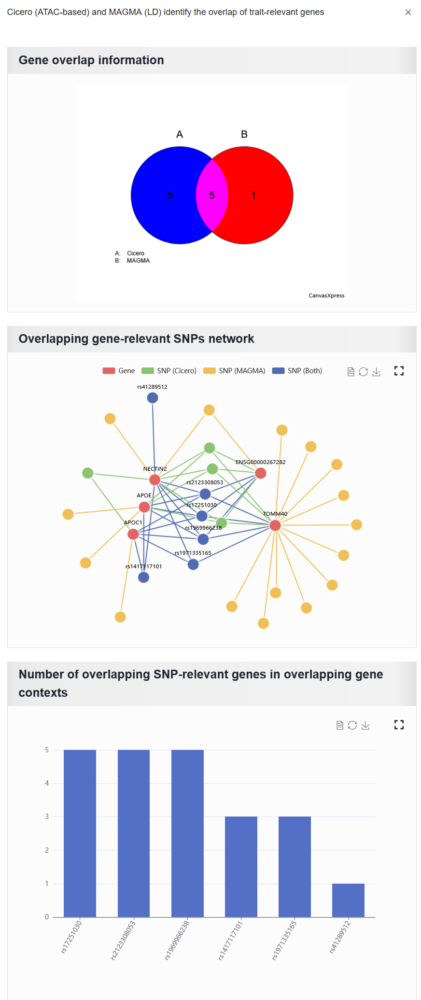

1. Gene overlap information: The overlap of gene sets identified by the two methods.
#. Overlapping gene-relevant SNPs network: This network consists solely of SNPs associated with overlapping genes. Here, the ``SNP (Both)`` refers to the intersection of the SNP sets associated with overlapping genes that were identified by both methods.
#. Number of overlapping SNP-relevant genes in overlapping gene contexts: The plot shows overlapping SNPs annotated by the number of overlapping genes. The x-axis represents the overlapping SNPs, and the y-axis represents the number of overlapping genes associated with each SNP.

2.4.4.2 Type: V2G annotation
""""""""""""""""""""""""""""""""

For a selected trait, any variant within the trait is annotated if it is present in eQTL, MPRA, and 3D chromatin interaction data.

For example: AD (sample_id_20 + trait_id_14530)

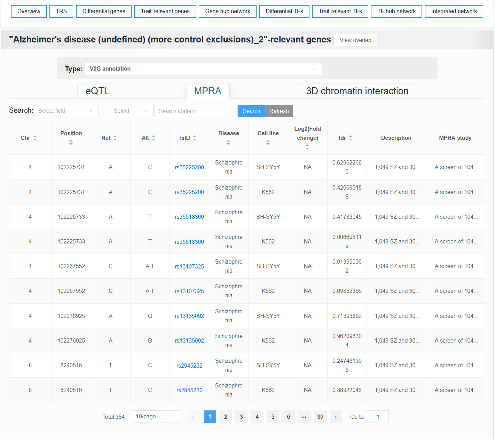

2.4.5 Gene hub network
^^^^^^^^^^^^^^^^^^^^^^^^^^^^^^^

To systematically investigate the association mechanisms between target traits and specific cell types, we integrated data from two key dimensions: the genetic variation dimension (trait-SNP-effect gene association data) and the cell-type-specific dimension (sample-cell type-differential gene), to construct a trait-cell type association network. This network helps reveal the multi-level regulatory paths through which traits influence cell types and identifies core gene sets.

For example: BCC (sample_id_1 + trait_id_894)

The ``Gene hub network`` result of the BCC case can be reproduced with the following parameter settings:

 | Cell type: ``Tumor 3``
 | Top count: ``All``
 | ``Core``
 | Gene (MAGMA): ``MAGMA``
 |     Number of SNPs: ``4``
 |     P value: ``≤ 1.0E-5``
 | Gene (Difference):
 |     Score: ``≥ 55``
 |     P value: ``≤ 1.0E-2``
 |     Adjusted p value: ``≤ 1.0E-2``
 |     Log2(Fold change): ``≥ 1``

.. image:: ../img/detail/gene_hub_network.png

.. note::

    If the user selects too many ``Top count`` and switches the button to ``All``, the browser may experience data loading lag or even crash, especially when the user's computer memory is low.

2.4.6 Differential TFs
^^^^^^^^^^^^^^^^^^^^^^^^^^^^^^^

It displays a data table and heatmap of the differences TF between cell types.

For example: BCC (sample_id_1 + trait_id_894)

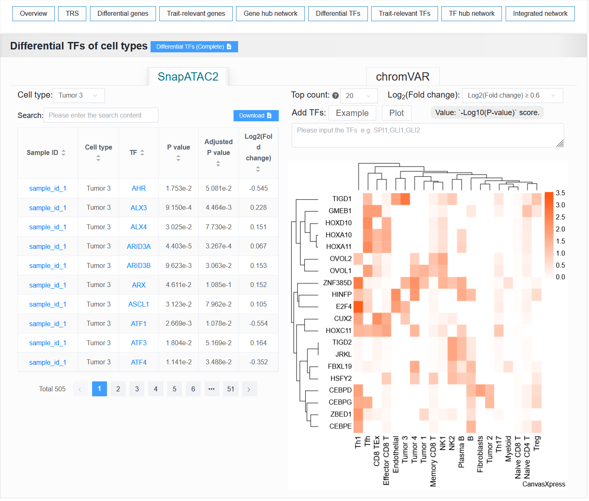

2.4.7 Trait-relevant TFs
^^^^^^^^^^^^^^^^^^^^^^^^^^^^^^^

It displays the results of TF enrichment analysis for this trait using HOMER.

.. image:: ../img/detail/homer.png

2.4.8 TF hub network
^^^^^^^^^^^^^^^^^^^^^^^^^^^^^^^

Similar to panel ``Gene hub network``, this panel constructs a network graph from trait to cell type to identify key TFs involved in the regulatory process.

The ``TF hub network`` result of the BCC case can be reproduced with the following parameter settings:

 | Cell type: ``Tumor 3``
 | ``All``
 | Trait-relevant TFs: ``HOMER``
 |     P value: ``≤ 0.05``
 |     Q value: ``≤ 0.05``
 | TF (Difference): ``SnapATAC2``
 |     P value: ``≤ 0.05``
 |     Adjusted p value: ``≤ 0.05``
 |     Log2(Fold change): ``≥ 0.6``

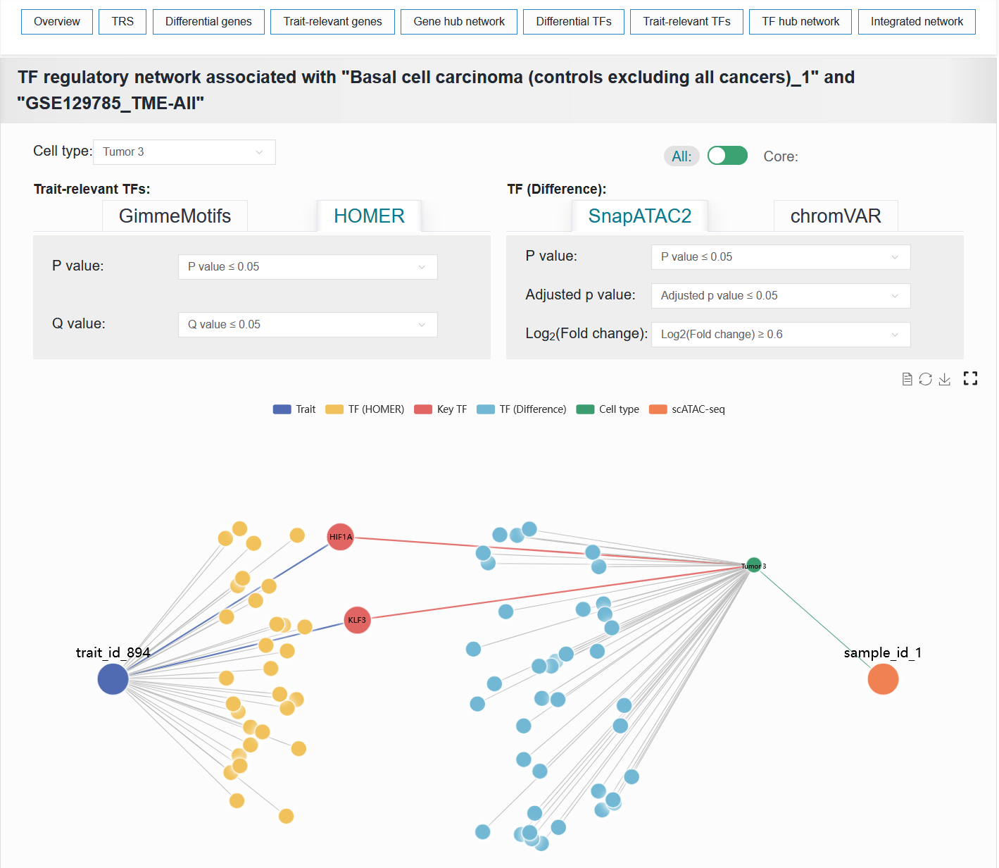

2.4.9 Integrated network
^^^^^^^^^^^^^^^^^^^^^^^^^^^^^^^

This module visualizes the integrated network composed of traits, variants, TFs, genes and cell types.

To facilitate understanding of how traits influence biological functions and disease susceptibility through specific cell types, we constructed a trait-cell type association network linked by genes and TFs, termed the gene-TF co-regulatory network. This integrative network leverages open chromatin as a bridge to capture the interaction links among genes, TFs, and variants, thereby establishing the core architecture of the regulatory landscape. In this three-way relationship, V2G and V2TF are obtained from the aforementioned the trait-relevant genes and TFs process. The TF-to-gene (TF2G) linking strategy is established based on peak co-accessibility associations, utilizing the BEDTools tool. Furthermore, numerous susceptibility-associated variant sites have been documented for traits or diseases, thereby establishing a trait-variant association network. Meanwhile, in single-cell samples, cell type-specific differentially active genes and TFs form gene and TF-cell type association networks. Thus, a comprehensive regulatory landscape network connecting traits to cell types is formed. Genes and transcription factors that lie along the trait-to-cell-type pathways are defined as key genes and key transcription factors.

For example: AD (sample_id_20 + trait_id_14530)

The ``Integrated network`` result of the AD case can be reproduced with the following parameter settings:

 | Cell type: ``MG``
 | ``Coordinates``
 | TF (GimmeMotifs):
 |     Co-score: ``≥ 0.2``
 |     Mean score: ``≥ 12``
 |     Count: ``≥ 1``
 | TF (Difference): ``SnapATAC2``
 |     P value: ``≤ 1.0E-2``
 |     Adjusted p value: ``≤ 1.0E-2``
 |     Log2(Fold change): ``≥ 0.7``
 | Gene (Cicero): ``Cicero``
 |     Co-score: ``≥ 0.3``
 | Gene (Difference): ``SnapATAC2``
 |     Score: ``≥ 3``
 |     P value: ``≤ 1.0E-125``
 |     Adjusted p value: ``≤ 1.0E-125``
 |     Log2(Fold change): ``≥ 0.6``

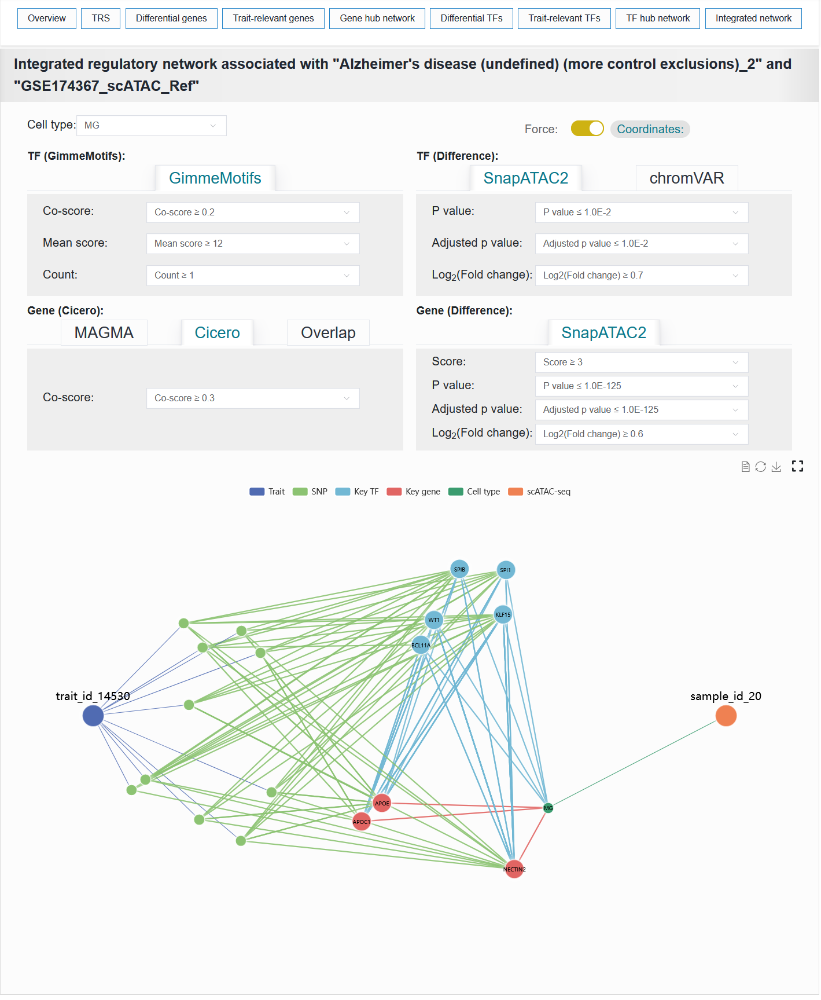
