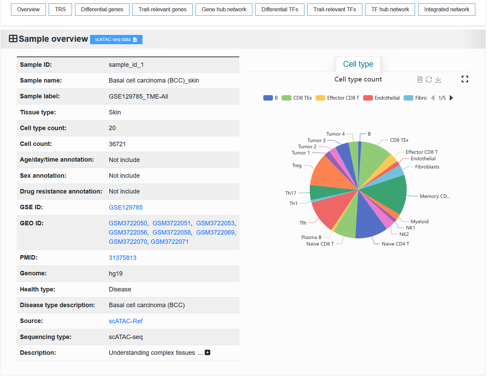
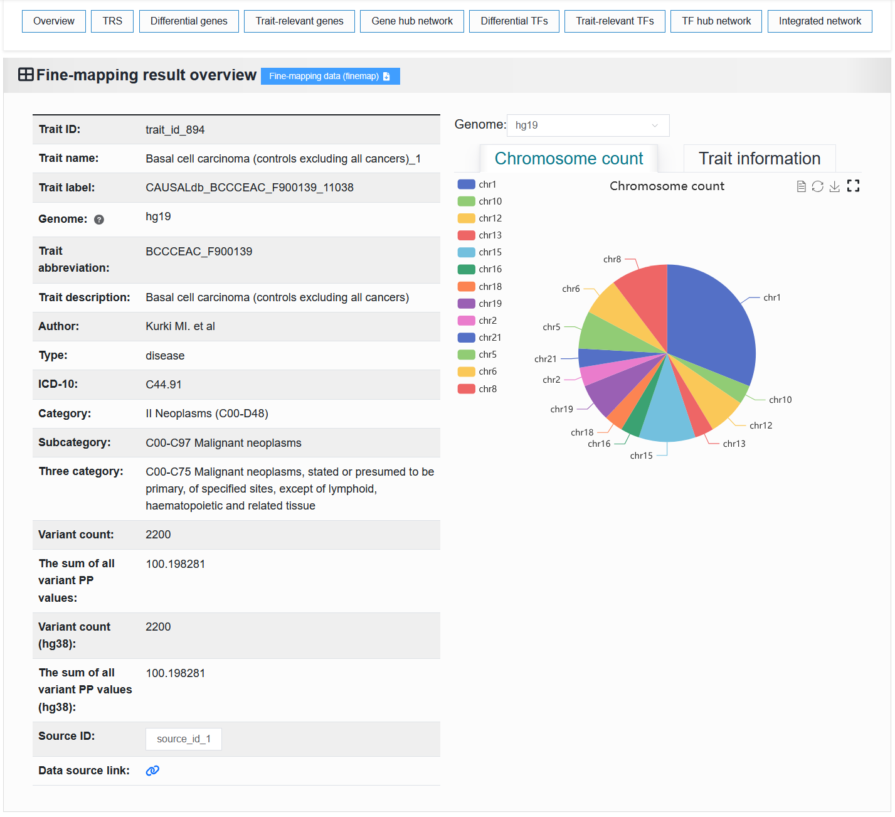

2.4 Detail
================

Access to the details page through the "`Data-browse <https://bio.liclab.net/scvdb/data_browse>`_" page or search results page, etc.

 | For a trait or disease example, consider basal cell carcinoma (BCC): https://bio.liclab.net/scvdb/detail?traitId=trait_id_894
 | For a scATAC-seq example: https://bio.liclab.net/scvdb/detail?sampleId=sample_id_1

We provide eight content panels for users to analyze data. You can quickly locate the designated panel by clicking on the button of the corresponding module.

2.4.1 Overview
^^^^^^^^^^^^^^^^^^^^^^^^^^^^^^^

Described the basic information content of the sample, as well as the basic statistical information.

2.4.1.1 scATAC-seq
*******************************

The basic information of the scATAC-seq sample is displayed on the left. The "Sample ID" is a unique identifier. "Sample label" is a unique identifier that contains sample information.

The proportion of cell types in the scATAC-seq sample is shown on the right.

We provide scATAC-seq data samples for download as H5ad files processed by `SnapATAC2 <https://scverse.org/SnapATAC2/>`_.

2.4.1.2 Fine-mapping result
*******************************

The left side displays basic information about the trait or disease. The "Trait ID" is a unique identifier. The "Trait label" is a unique identifier that contains trait or disease information.

The right side displays the proportion of chromosomes and detailed causal variant information in the trait or disease.

We provide the download of this fine-mapping result.

.. note::

    Among these, six fields (`Type`, `ICD-10`, `Category`, `Subcategory`, `Three category`) were manually added. There is a very small probability of misclassification. If you find any, please inform us at yuzmbio@163.com. Thank you very much for your contribution.

2.4.2 Enriched cells
^^^^^^^^^^^^^^^^^^^^^^^^^^^^^^^

We provide two parts, the first part is to display the information of sample enrichment, and the second part is to select a certain enriched sample and visualize the enrichment effect.

.. note::

    The first part will display different data types (scATAC-seq samples or fine-mapping results). The second part shows the exact same situation. Regardless of whether the user is viewing the detailed page of the scATAC-seq sample or the fine-mapping result, the six panels at the back display the same process content.

2.4.1.1 The first part
*******************************

scATAC-seq sample:
 | The table on the left displays the traits or diseases enriched with this single-cell sample. The right side visualizes the proportion of enrichment.

.. image:: ../img/detail/sample_enrichment.png

Fine-mapping result:
 | On the left is a table of single-cell samples associated with this trait or disease. The right side visualizes the proportion of enrichment.

.. image:: ../img/detail/trait_enrichment.png

2.4.1.2 The second part
*******************************

Visualize the enrichment of a trait or disease in a single-cell sample.

.. image:: ../img/detail/trs.png

2.4.3 Differential genes
^^^^^^^^^^^^^^^^^^^^^^^^^^^^^^^

It displays a heatmap and a data table of differentially expressed genes between cell types (based on scATAC seq data for gene activity scoring), as well as a bubble plot describing pathway and GO enrichment analysis results.

.. image:: ../img/detail/differential_genes.png

Click the ``Top count`` option to set to ``5``, then click ``Example``, and finally click the ``Plot`` button.
After running, we can see the differential gene expression heatmap of BCC case in the article.

.. image:: ../img/detail/differential_genes_article.png

2.4.4 Genes with enriched trait
^^^^^^^^^^^^^^^^^^^^^^^^^^^^^^^

For the given traits, we performed MAGMA gene-level analysis, followed by pathway and GO enrichment analysis of significantly associated genes, with the results visualized using bubble plots.

.. image:: ../img/detail/magma.png

After clicking the View button, users can see detailed variant information associated with this gene.

.. image:: ../img/detail/magma_view.png

2.4.5 Gene hub network
^^^^^^^^^^^^^^^^^^^^^^^^^^^^^^^

To systematically investigate the association mechanisms between target traits and specific cell types, we integrated data from two key dimensions: the genetic variation dimension (trait-SNP-effect gene association data) and the cell-type-specific dimension (sample-cell type-differential gene), to construct a trait-cell type association network. This network helps reveal the multi-level regulatory paths through which traits influence cell types and identifies core gene sets.

2.4.6 Differential TFs
^^^^^^^^^^^^^^^^^^^^^^^^^^^^^^^

It displays a data table and heatmap of the differences TF between cell types.

.. image:: ../img/detail/differential_tfs.png

2.4.7 TFs with enriched trait
^^^^^^^^^^^^^^^^^^^^^^^^^^^^^^^

It displays the results of TF enrichment analysis for this trait using HOMER.

.. image:: ../img/detail/homer.png

2.4.8 TF hub network
^^^^^^^^^^^^^^^^^^^^^^^^^^^^^^^

Similar to panel ``Gene hub network``, this panel constructs a network graph from trait to cell type to identify key TFs involved in the regulatory process.

.. image:: ../img/detail/tf_hub_network.png
