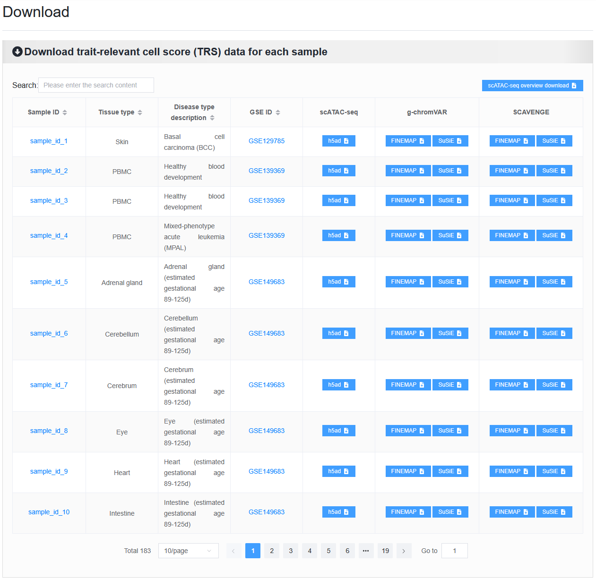
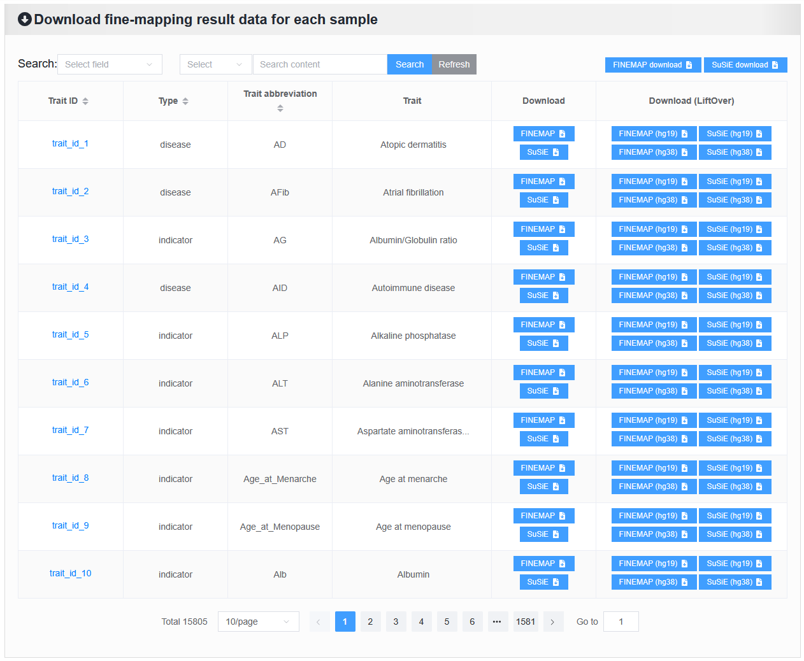
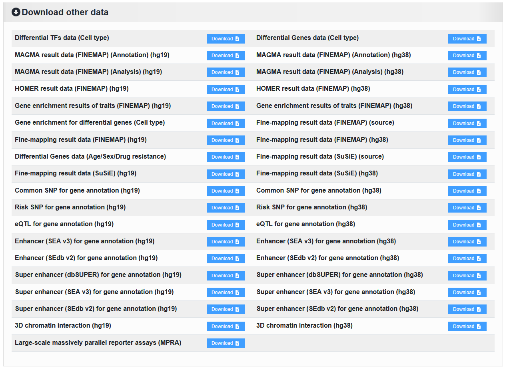
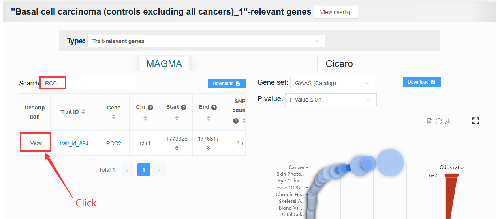
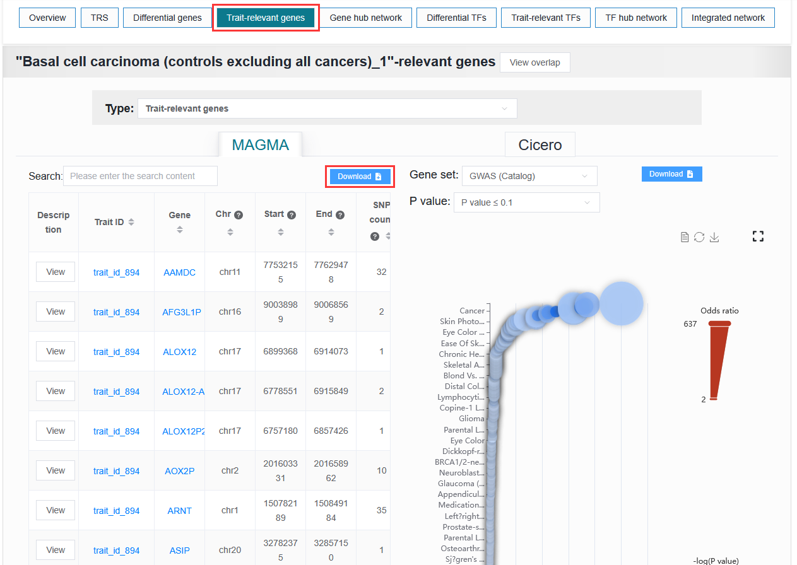

2.7 Download
================

 | Link: https://bio.liclab.net/scvmap/download

All downloadable data provides users with a centralized access portal aimed at facilitating their access to research resources.
We have integrated the following comprehensive datasets:
(i) scATAC-seq data;
(ii) Fine-mapping results;
(iii) The trait--relevant score (TRS) of each single-cell generated by g-chromVAR and SCAVENGE methods;
(iv) Results of gene and TF related analysis;
(v) Gene regulation annotation data.

2.7.1 Download TRS data for each sample
^^^^^^^^^^^^^^^^^^^^^^^^^^^^^^^^^^^^^^^^^^^^^^^^^^^^^^^^^^^^^^^^^^^^^^^^^^^^^^^^^

Below are the detailed download instructions.

2.7.1.1 Overview of scATAC-seq data: ``txt`` file
"""""""""""""""""""""""""""""""""""""""""""""""""""""""""""""""""""""""""""""""""

==== =========================== ==============================================================================================================================================================
#    Column name                 Description
==== =========================== ==============================================================================================================================================================
1    f_sample_id                 The unique identifier of the single-cell sample, used for database operations.
2    f_gse_id                    GSE ID
3    f_genome                    The reference genome of the single-cell sample.
4    f_geo_id                    GEO ID
5    f_label                     The unique identifier for the single-cell sample, used as the file name during data processing.
6    f_pmid                      PMID
7    f_species                   The species information of the single-cell sample. All data belongs to humans.
8    f_tissue_type               The tissue type of the single-cell sample.
9    f_sequencing_type           The sequencing type of the single-cell sample.
10   f_health_type               The health type of the single-cell sample.
11   f_health_type_description   Detailed information on the health type of the single-cell sample.
12   f_description               Detailed information on the content of the single-cell sample.
13   f_source                    The source name of the single-cell sample.
14   f_source_url                The link to the source of the single-cell sample.
15   f_counts_layer              The layer name of the counts matrix stored in the Seurat object of the single-cell sample.
16   f_sample_exist              The single-cell sample contains multiple sample information.
17   f_cell_count                The number of cells in the single-cell sample.
18   f_cell_type_count           The number of cell types in the single-cell sample.
19   f_index                     The unique index identifier of the single-cell sample has no meaning and is only used for sorting.
20   f_time                      An indicator variable for whether this single-cell sample contains cell annotation information for age/day/time. 1 indicates presence, 0 indicates absence.
21   f_sex                       An indicator variable for whether this single-cell sample contains cell annotation information for sex. 1 indicates presence, 0 indicates absence.
22   f_drug                      An indicator variable for whether this single-cell sample contains cell annotation information for drug resistance. 1 indicates presence, 0 indicates absence.
==== =========================== ==============================================================================================================================================================

.. note::

    When downloading files, some browsers will directly open the ``txt`` file and need to save the file by right-click.

.. image:: ../img/download/txt_download.png

2.7.1.2 scATAC-seq data: ``H5AD`` file
"""""""""""""""""""""""""""""""""""""""""""""""""""""""""""""""""""""""""""""""""

Read the information of ``sample_id_1``.

.. code-block:: python
    :linenos:

    >>> data
    AnnData object with n_obs × n_vars = 36721 × 414680
        obs: 'n_fragment', 'frac_dup', 'frac_mito', 'tsse', 'doublet_probability', 'doublet_score', 'barcode', 'n_genes', 'n_counts', 'cell_type', 'UMAP1', 'UMAP2', 'barcodes'
        var: 'count', 'selected', 'chr', 'start', 'end', 'n_cells'
        uns: 'doublet_rate', 'macs3', 'params', 'project_name', 'project_version', 'reference_sequences', 'scrublet_sim_doublet_score', 'step'
        obsm: 'fragment_paired'
    >>>
    >>>
    >>> data.var
                                count  selected   chr      start        end  n_cells
    index
    chr1:237500-238000          316.0      True  chr1     237500     238000      296
    chr1:238000-238500          316.0      True  chr1     238000     238500      296
    chr1:540500-541000          222.0      True  chr1     540500     541000      217
    chr1:541000-541500          222.0      True  chr1     541000     541500      217
    chr1:713500-714000        10773.0      True  chr1     713500     714000    10145
    ...                           ...       ...   ...        ...        ...      ...
    chrX:155232500-155233000    246.0      True  chrX  155232500  155233000      225
    chrX:155233500-155234000    200.0      True  chrX  155233500  155234000      186
    chrX:155234000-155234500    200.0      True  chrX  155234000  155234500      186
    chrX:155260000-155260500    603.0      True  chrX  155260000  155260500      563
    chrX:155260500-155261000    603.0      True  chrX  155260500  155261000      563

    [414680 rows x 6 columns]
    >>>
    >>>
    >>> data.obs
                        n_fragment  frac_dup  frac_mito       tsse  doublet_probability  doublet_score             barcode  n_genes  n_counts    cell_type      UMAP1      UMAP2            barcodes
    index
    AAACGAAAGAACGACC-1       24764  0.613793        0.0  14.751286             0.102154       0.095522  AAACGAAAGAACGACC-1    46094     49528      Tumor 4  10.567199  -4.781785  AAACGAAAGAACGACC-1
    AAACGAAAGAATACTG-1        2506  0.389822        0.0  14.333112             0.185441       0.001557  AAACGAAAGAATACTG-1     4809      5012      Myeloid   1.443223  13.324852  AAACGAAAGAATACTG-1
    AAACGAAAGACACGGT-1        4923  0.478827        0.0  23.241852             0.124562       0.040230  AAACGAAAGACACGGT-1     9438      9846         Treg  -1.004199  -7.261578  AAACGAAAGACACGGT-1
    AAACGAAAGACCCTAT-1        3674  0.443755        0.0  21.428571             0.172410       0.007480  AAACGAAAGACCCTAT-1     7059      7348            B  -5.697628  13.187097  AAACGAAAGACCCTAT-1
    AAACGAAAGAGGTACC-1        7178  0.488674        0.0  20.920746             0.152831       0.018101  AAACGAAAGAGGTACC-1    13666     14356      CD8 TEx  -5.956334  -3.010488  AAACGAAAGAGGTACC-1
    ...                        ...       ...        ...        ...                  ...            ...                 ...      ...       ...          ...        ...        ...                 ...
    TTTGTGTTCGAGGCTC-1        4853  0.432597        0.0  17.623604             0.179749       0.004054  TTTGTGTTCGAGGCTC-1     9306      9706         Treg   1.477226  -8.637981  TTTGTGTTCGAGGCTC-1
    TTTGTGTTCGGGTCCA-1        5016  0.492256        0.0  24.892704             0.174884       0.006297  TTTGTGTTCGGGTCCA-1     9551     10032         Treg   2.348910  -6.036977  TTTGTGTTCGGGTCCA-1
    TTTGTGTTCGTCCCAT-1       12915  0.498855        0.0  15.457507             0.122509       0.042428  TTTGTGTTCGTCCCAT-1    24172     25830      CD8 TEx  -8.256992  -3.043979  TTTGTGTTCGTCCCAT-1
    TTTGTGTTCTCTTCCT-1        5429  0.461569        0.0  19.229330             0.173898       0.006765  TTTGTGTTCTCTTCCT-1    10422     10858         Treg   2.174267  -8.784227  TTTGTGTTCTCTTCCT-1
    TTTGTGTTCTGCCGAG-1        3275  0.425842        0.0  16.528926             0.151769       0.018755  TTTGTGTTCTGCCGAG-1     6310      6550  Naive CD8 T  -0.882584   1.916430  TTTGTGTTCTGCCGAG-1

    [36721 rows x 13 columns]

2.7.1.3 The result data of method g-ChromVAR: ``H5AD`` file
"""""""""""""""""""""""""""""""""""""""""""""""""""""""""""""""""""""""""""""""""

Read the information of ``sample_id_1 + FINEMAP``.

 | ``obs``: Cell
 | ``var``: Trait or disease
 | ``X``: Z-score

.. code-block:: python
    :linenos:

    >>> data
    AnnData object with n_obs × n_vars = 36721 × 15805
        obs: 'f_sample_id', 'f_barcodes', 'f_cell_type', 'f_sample', 'f_umap_x', 'f_umap_y', 'f_tsse', 'f_index', 'f_cell_type_index'
        var: 'f_trait_id', 'f_trait_code', 'f_source_genome', 'f_trait_abbr', 'f_trait', 'f_variant_count'
    >>>
    >>> data.var
                        f_trait_id                               f_trait_code f_source_genome                 f_trait_abbr                                            f_trait  f_variant_count
    f_trait_id
    trait_id_826      trait_id_826          CAUSALdb_Appendicitis_PE06234_672            hg19         Appendicitis_PE06234                                       Appendicitis               13
    trait_id_2146    trait_id_2146                  CAUSALdb_COE_FG02496_3096            hg19                  COE_FG02496                                Cancer of esophagus                2
    trait_id_3466    trait_id_3466  CAUSALdb_EHKPCAORROACYBNITLY_FG00466_5927            hg19  EHKPCAORROACYBNITLY_FG00466  Ever had known person concerned about, or reco...                1
    trait_id_1156    trait_id_1156                  CAUSALdb_BNT_F900340_4465            hg19                  BNT_F900340                            Benign neoplasm: Testis                1
    trait_id_1816    trait_id_1816                   CAUSALdb_CI_FG00089_4526            hg19                   CI_FG00089                                      Carrot intake               21
    ...                        ...                                        ...             ...                          ...                                                ...              ...
    trait_id_15801  trait_id_15801                            UKBB_Worrier_43            hg19                      Worrier                                            Worrier             5683
    trait_id_15802  trait_id_15802                     UKBB_Worry_Too_Long_85            hg19               Worry_Too_Long                 Worry too long after embarrassment             3225
    trait_id_15803  trait_id_15803                                UKBB_eBMD_6            hg19                         eBMD                Estimated heel bone mineral density            37155
    trait_id_15804  trait_id_15804                               UKBB_eGFR_15            hg19                         eGFR  Estimated glomerular filtration rate (serum cr...            35955
    trait_id_15805  trait_id_15805                             UKBB_eGFRcys_3            hg19                      eGFRcys   Estimated glomerular filtration rate (cystain C)            37319

    [15805 rows x 6 columns]
    >>>
    >>> data.obs
                        f_sample_id          f_barcodes  f_cell_type   f_sample   f_umap_x   f_umap_y     f_tsse  f_index  f_cell_type_index
    index
    AAACGAAAGAACGACC-1  sample_id_1  AAACGAAAGAACGACC-1      Tumor 4  GSE129785  10.567199  -4.781785  14.751286        1                  0
    AAACGAAAGAATACTG-1  sample_id_1  AAACGAAAGAATACTG-1      Myeloid  GSE129785   1.443223  13.324852  14.333112        2                  0
    AAACGAAAGACACGGT-1  sample_id_1  AAACGAAAGACACGGT-1         Treg  GSE129785  -1.004199  -7.261578  23.241852        3                  0
    AAACGAAAGACCCTAT-1  sample_id_1  AAACGAAAGACCCTAT-1            B  GSE129785  -5.697628  13.187097  21.428571        4                  0
    AAACGAAAGAGGTACC-1  sample_id_1  AAACGAAAGAGGTACC-1      CD8 TEx  GSE129785  -5.956334  -3.010488  20.920746        5                  0
    ...                         ...                 ...          ...        ...        ...        ...        ...      ...                ...
    TTTGTGTTCGAGGCTC-1  sample_id_1  TTTGTGTTCGAGGCTC-1         Treg  GSE129785   1.477226  -8.637981  17.623604    36717               4065
    TTTGTGTTCGGGTCCA-1  sample_id_1  TTTGTGTTCGGGTCCA-1         Treg  GSE129785   2.348910  -6.036977  24.892704    36718               4066
    TTTGTGTTCGTCCCAT-1  sample_id_1  TTTGTGTTCGTCCCAT-1      CD8 TEx  GSE129785  -8.256992  -3.043979  15.457507    36719               3897
    TTTGTGTTCTCTTCCT-1  sample_id_1  TTTGTGTTCTCTTCCT-1         Treg  GSE129785   2.174267  -8.784227  19.229330    36720               4067
    TTTGTGTTCTGCCGAG-1  sample_id_1  TTTGTGTTCTGCCGAG-1  Naive CD8 T  GSE129785  -0.882584   1.916430  16.528926    36721               2767

    [36721 rows x 9 columns]
    >>>
    >>> data.X.todense()
    matrix([[ 0.        ,  0.        ,  0.        , ...,  1.34798235,
              0.13897425,  0.46950752],
            [ 0.        ,  0.        ,  0.        , ..., -0.27093183,
             -0.28416698,  0.2759976 ],
            [ 0.        ,  0.        ,  0.        , ..., -0.6249468 ,
              0.11480793, -1.2071487 ],
            ...,
            [ 0.        ,  0.        ,  0.        , ..., -0.40784247,
              0.35490693, -0.85452906],
            [ 0.        ,  0.        ,  0.        , ...,  0.50343663,
              0.07536454,  0.42840868],
            [ 0.        ,  0.        ,  0.        , ..., -0.82765052,
              0.20382107,  0.89792407]])

2.7.1.4 The result data of method SCAVENGE: ``H5AD`` file
"""""""""""""""""""""""""""""""""""""""""""""""""""""""""""""""""""""""""""""""""

Read the information of ``sample_id_1 + FINEMAP``.

 | ``obs``: Cell
 | ``var``: Trait or disease
 | ``X``: TRS

.. code-block:: python
    :linenos:

    >>> data
    AnnData object with n_obs × n_vars = 36721 × 15805
        obs: 'f_sample_id', 'f_barcodes', 'f_cell_type', 'f_sample', 'f_umap_x', 'f_umap_y', 'f_tsse', 'f_index', 'f_cell_type_index'
        var: 'f_trait_id', 'f_trait_code', 'f_source_genome', 'f_trait_abbr', 'f_trait', 'f_variant_count'
    >>>
    >>>
    >>> data.X.todense()
    matrix([[0.        , 0.        , 0.        , ..., 0.11992209, 0.26094234,
             0.35693139],
            [0.        , 0.        , 0.        , ..., 0.50589785, 2.59232072,
             1.68724861],
            [0.        , 0.        , 0.        , ..., 0.10034563, 0.40161146,
             0.31860852],
            ...,
            [0.        , 0.        , 0.        , ..., 0.03006235, 0.37951727,
             0.08840483],
            [0.        , 0.        , 0.        , ..., 0.09616686, 0.52534063,
             0.47852776],
            [0.        , 0.        , 0.        , ..., 0.21577299, 0.47587153,
             0.39203965]])
    >>>

2.7.2 Download fine-mapping result data for each sample
^^^^^^^^^^^^^^^^^^^^^^^^^^^^^^^^^^^^^^^^^^^^^^^^^^^^^^^^^^^^^^^^^^^^^^^^^^^^^^^^^

Below are the detailed download instructions.

2.7.2.1 Overview of fine-mapping result data: ``xlsx`` file
"""""""""""""""""""""""""""""""""""""""""""""""""""""""""""""""""""""""""""""""""

==== ==================== ============================================================================================================================================================
#    Column name          Description
==== ==================== ============================================================================================================================================================
1    f_trait_id           The unique identifier of the trait used for searching in the database.
2    f_trait_index        The unique identifier of the trait, used for sorting in the database, corresponds one-to-one with 'f_trait_id'.
3    f_trait_code         The unique identifier of the trait, used as the file name for the file processing procedure.
4    f_trait_abbr         The abbreviation form of the trait.
5    f_trait              Detailed information for the trait.
6    f_type               The trait is classified as one of the types of "disease", "drug", "compound", "health", "subject", "treatment", "symptom", "indicator" or "other".
7    f_icd10              ICD-10
8    f_category           Major categories in ICD-10
9    f_sub_category       Subcategories in ICD-10
10   f_three_category     The third category in ICD-10
11   f_source_id          Unique ID of the trait source cohort.
12   f_source_name        Name of the trait source cohort.
13   f_source_genome      Reference genome of trait source cohort. (Reference genome of the trait before LiftOver)
14   f_variant_count      The number of variant in the trait before LiftOver.
15   f_variant_pp_sum     The total PP value of variant in the trait before LiftOver.
16   f_hg19_count         The number of variant in the trait based on hg19 as a background reference genome.
17   f_hg38_count         The number of variant in the trait based on hg38 as a background reference genome.
18   f_hg19_pp_sum        The total PP value of variant in the trait based on hg19 as a background reference genome.
19   f_hg38_pp_sum        The total PP value of variant in the trait based on hg38 as a background reference genome.
20   f_cohort             The cohort for collecting the trait.
21   f_author             The author of the origin of the trait.
22   f_mesh_id            MESH ID
23   f_mesh_term          MESH TERM
24   f_meta_id            META ID
25   f_popu               Experimental population
26   f_pmid               PMID
27   f_n_case             Case size
28   f_n_control          Control size
29   f_sample_size        Sample size
30   f_filter             Each trait is retained, with a value of 1 for all.
31   f_index              The unique index identifier given in the same source cohort has no meaning and is only used to distinguish different traits in the same source cohort.
32   f_url                The link to download the source of each trait.
==== ==================== ============================================================================================================================================================

2.7.2.2 Fine-mapping result data
"""""""""""""""""""""""""""""""""""""""""""""""""""""""""""""""""""""""""""""""""

1. ``txt`` file (``Download`` field)

This file was formed through uniform processing after the original download.

==== ==================== ====================================================================================================
#    Column name          Description
==== ==================== ====================================================================================================
1    trait_code           unique identifier of the trait, used as the file name for the file processing procedure
2    chr                  chromosome in the reference genome coordinate of the source cohort
3    position             position of variant in the reference genome coordinate of the source cohort
4    variant              unique variant identifier
5    rsId                 rsID identifier
6    allele1              reference allele in the reference genome coordinate of the source cohort
7    allele2              alternative allele in the reference genome coordinate of the source cohort. (This allele is the effect allele.)
8    maf                  allele frequency of the minor allele in cohort
9    af                   allele frequency of allele2 (alt)
10   beta                 marginal association effect size from linear mixed model/effect size GWAS
11   se                   standard error on marginal association effect size from linear mixed model/standard error GWAS
12   p_value              p-value GWAS
13   chisq                test statistic for marginal association
14   z_score              original z-score
15   pp                   posterior probability of association from fine-mapping (FINEMAP or SuSiE)
16   beta_posterior       posterior expectation of true effect size
17   sd_posterior         posterior standard deviation of true effect size
18   trait_abbr           abbreviation for the trait
19   trait                detailed information for the trait
20   index                Unique index identifiers based on trait or disease variants are meaningless and can be used to identify the uniqueness of variants.
==== ==================== ====================================================================================================

.. note::

    When collecting fine-mapping result data, some data may not include all columns, and a small number of columns may have null values. Of course, the four columns of "chr", "position", "pp", and "trait" are definitely included.

2. ``bed`` file (``Download (LiftOver)`` field)

scVMAP provides variant coordinates under different reference genomes.

==== ==================== ====================================================================================================================================
#    Column name          Description
==== ==================== ====================================================================================================================================
1    None                 chromosome in hg19/hg38 coordinates
2    None                 (start) position of variant in hg19/hg38 coordinates
3    None                 (end) position of variant in hg19/hg38 coordinates
4    None                 rsID identifier
5    None                 posterior probability of association from fine-mapping (FINEMAP or SuSiE)
6    None                 abbreviation for the trait
7    None                 Unique index identifiers based on trait or disease variants are meaningless and can be used to identify the uniqueness of variants.
==== ==================== ====================================================================================================================================

.. note::

    This format of data is suitable for performing overlay operations with enhancer data, etc.

.. note::

    The download name is the same regardless of the method or reference genome selected, so please be aware of this.

2.7.3 Download other data
^^^^^^^^^^^^^^^^^^^^^^^^^^^^^^^^^^^^^^^^^^^^^^^^^^^^^^^^^^^^^^^^^^^^^^^^^^^^^^^^^

2.7.3.1 Fine-mapping result data: ``tar.gz`` file
"""""""""""""""""""""""""""""""""""""""""""""""""""""""""""""""""""""""""""""""""

Here is the complete download for Part ``2.7.2 Download fine-mapping result data for each sample``.

 | Fine-mapping result data (FINEMAP/SuSiE) (source): ``txt`` file (``Download`` field)

 | Repeat display once:

==== ==================== ====================================================================================================
#    Column name          Description
==== ==================== ====================================================================================================
1    trait_code           unique identifier of the trait, used as the file name for the file processing procedure
2    chr                  chromosome in the reference genome coordinate of the source cohort
3    position             position of variant in the reference genome coordinate of the source cohort
4    variant              unique variant identifier
5    rsId                 rsID identifier
6    allele1              reference allele in the reference genome coordinate of the source cohort
7    allele2              alternative allele in the reference genome coordinate of the source cohort. (This allele is the effect allele.)
8    maf                  allele frequency of the minor allele in cohort
9    af                   allele frequency of allele2 (alt)
10   beta                 marginal association effect size from linear mixed model/effect size GWAS
11   se                   standard error on marginal association effect size from linear mixed model/standard error GWAS
12   p_value              p-value GWAS
13   chisq                test statistic for marginal association
14   z_score              original z-score
15   pp                   posterior probability of association from fine-mapping (FINEMAP)
16   beta_posterior       posterior expectation of true effect size
17   sd_posterior         posterior standard deviation of true effect size
18   trait_abbr           abbreviation for the trait
19   trait                detailed information for the trait
20   index                Unique index identifiers based on trait or disease variants are meaningless and can be used to identify the uniqueness of variants.
==== ==================== ====================================================================================================

 | Fine-mapping result data (FINEMAP/SuSiE) (hg19/hg38): ``bed`` file (``Download (LiftOver)`` field)

 | Repeat display once:

==== ==================== ====================================================================================================
#    Column name          Description
==== ==================== ====================================================================================================
1    None                 chromosome in hg19/hg38 coordinates
2    None                 (start) position of variant in hg19/hg38 coordinates
3    None                 (end) position of variant in hg19/hg38 coordinates
4    None                 rsID identifier
5    None                 posterior probability of association from fine-mapping (FINEMAP or SuSiE)
6    None                 abbreviation for the trait
7    None                 Unique index identifiers based on trait or disease variants are meaningless and can be used to identify the uniqueness of variants.
==== ==================== ====================================================================================================

2.7.3.2 Differential gene data: ``txt`` file
"""""""""""""""""""""""""""""""""""""""""""""""""""""""""""""""""""""""""""""""""

 | Differential Genes data (Cell type): ``tar.gz`` file

This file contains differential gene data for all cell types of single-cell samples. Of course, it is after passing the threshold.

==== ==================== ====================================================================================================
#    Column name          Description
==== ==================== ====================================================================================================
1    f_sample_id          unique identifier of scATAC-seq sample
2    f_cell_type          cell type
3    f_gene               gene name
4    f_score              score
5    f_adjusted_p_value   adjusted p value
6    f_log2_fold_change   Log2(Fold change)
7    f_p_value            P-value
==== ==================== ====================================================================================================

 | Differential Genes data (Age/Sex/Drug resistance): ``txt`` file

This file contains differential gene data for all cell types of single-cell samples. Of course, it is after passing the threshold.

==== ==================== ====================================================================================================
#    Column name          Description
==== ==================== ====================================================================================================
1    f_sample_id          unique identifier of scATAC-seq sample
2    f_type_value         Corresponds to the values under the `f_type` field.
3    f_gene               gene name
4    f_score              score
5    f_adjusted_p_value   adjusted p value
6    f_log2_fold_change   Log2(Fold change)
7    f_p_value            P-value
7    f_type               Age, gender, or drug resistance information.
==== ==================== ====================================================================================================

.. note::

    You need to download the complete data without threshold filtering, and enter the details page of the sample to download the ``H5AD`` file.

Example: `sample_id_1 <https://bio.liclab.net/scvmap/detail?sampleId=sample_id_1>`_

.. image:: ../img/download/difference_gene_h5ad.png

 | ``obs``: gene
 | ``var``: cell type
 | ``X``: score
 | ``layers``: adjusted p value, Log2(Fold change), P-value

.. code-block:: python
    :linenos:

    >>> data
    AnnData object with n_obs × n_vars = 33501 × 20
        obs: 'n_cells'
        var: 'cell_type', 'size'
        uns: 'diff_genes'
        layers: 'adjusted_p_value', 'log2_fold_change', 'p_value'
    >>>
    >>> data.var
                         cell_type  size
    cell_type
    B                            B   404
    CD8 TEx                CD8 TEx  3898
    Effector CD8 T  Effector CD8 T  1153
    Endothelial        Endothelial   562
    Fibroblasts        Fibroblasts  1325
    Memory CD8 T      Memory CD8 T  4965
    Myeloid                Myeloid   732
    NK1                        NK1   418
    NK2                        NK2  1207
    Naive CD4 T        Naive CD4 T  4059
    Naive CD8 T        Naive CD8 T  2768
    Plasma B              Plasma B   335
    Tfh                        Tfh  4138
    Th1                        Th1   338
    Th17                      Th17  1842
    Treg                      Treg  4068
    Tumor 1                Tumor 1   757
    Tumor 2                Tumor 2   875
    Tumor 3                Tumor 3  1687
    Tumor 4                Tumor 4  1190
    >>>
    >>> data.obs
                     n_cells
    AP006222.2           296
    ENSG00000286448      296
    ENSG00000230021    14992
    ENSG00000228327    10389
    LINC01409          10389
    ...                  ...
    TMLHE               4231
    SPRY3               5205
    VAMP7               7748
    IL9R                5738
    ENSG00000270726      395

    [33501 rows x 1 columns]
    >>>
    >>> data.X
    array([[-16.08996773,  16.2977314 ,  -3.94544339, ...,  22.60018349,
             65.58148956,  41.31241226],
           [ -9.23847771,  38.57592773, -28.23983192, ...,  -8.53127384,
             16.334095  ,  46.58874512],
           [ -9.22247505,  38.53868484, -28.31791878, ...,  -8.08869743,
             16.5304184 ,  46.68078613],
           ...,
           [ -0.73027158,  34.58570862,  42.81091309, ..., -33.24862289,
            -56.29743958, -51.4512825 ],
           [ 12.86117554, -13.21335506,  -1.77498877, ..., -29.03244019,
            -39.19504929, -43.00321579],
           [-16.56791496, -32.8029213 ,   2.89613366, ...,  38.49712753,
             32.102005  , -17.40989685]])
    >>>

2.7.3.3 Differential TF data: ``txt`` file
"""""""""""""""""""""""""""""""""""""""""""""""""""""""""""""""""""""""""""""""""

This file contains differential TF data for all cell types of single-cell samples. Of course, it is after passing the threshold.

==== ==================== ====================================================================================================
#    Column name          Description
==== ==================== ====================================================================================================
1    f_sample_id          unique identifier of scATAC-seq sample
2    f_cell_type          cell type
3    f_tf                 transcription factor name
4    f_tf_id              unique identifier of transcription factor
5    f_p_value            P-value
6    f_adjusted_p_value   adjusted p value
7    f_log2_fold_change   Log2(Fold change)
==== ==================== ====================================================================================================

.. note::

    You need to download the complete data without threshold filtering, and enter the details page of the sample to download the ``H5AD`` file.

Example: `sample_id_1 <https://bio.liclab.net/scvmap/detail?sampleId=sample_id_1>`_

 | ``obs``: TF
 | ``var``: cell type
 | ``X``: P-value
 | ``layers``: adjusted p value, Log2(Fold change)

.. code-block:: python
    :linenos:

    >>> data
    AnnData object with n_obs × n_vars = 1165 × 20
        obs: 'id', 'name'
        var: 'cell_type', 'size'
        layers: 'adjusted_p_value', 'log2_fold_change'
    >>>
    >>> data.obs
                                                id        name
    index
    AC023509.3+M02872_2.00  AC023509.3+M02872_2.00  AC023509.3
    AC138696.1+M04597_2.00  AC138696.1+M04597_2.00  AC138696.1
    AHR+M09817_2.00                AHR+M09817_2.00         AHR
    AIRE+M09375_2.00              AIRE+M09375_2.00        AIRE
    ALX1+M05327_2.00              ALX1+M05327_2.00        ALX1
    ...                                        ...         ...
    ZSCAN4+M02919_2.00          ZSCAN4+M02919_2.00      ZSCAN4
    ZSCAN5+M04460_2.00          ZSCAN5+M04460_2.00      ZSCAN5
    ZSCAN5C+M08390_2.00        ZSCAN5C+M08390_2.00     ZSCAN5C
    ZSCAN9+M04466_2.00          ZSCAN9+M04466_2.00      ZSCAN9
    ZZZ3+M01272_2.00              ZZZ3+M01272_2.00        ZZZ3

    [1165 rows x 2 columns]
    >>>
    >>> data.X
    array([[1.01662951e-01, 1.74660328e-01, 2.50931395e-01, ...,
            6.34538848e-02, 7.25013930e-02, 5.10951651e-05],
           [2.07562180e-01, 1.93983057e-01, 2.10357488e-01, ...,
            3.01950908e-01, 3.46950746e-01, 8.56932171e-02],
           [2.40413032e-01, 9.76634287e-02, 6.66147596e-01, ...,
            2.68301581e-01, 1.75328527e-02, 1.26211337e-03],
           ...,
           [4.38363454e-01, 1.43397437e-01, 4.24778841e-01, ...,
            7.15759727e-03, 5.41759614e-02, 9.35845828e-12],
           [4.86767592e-01, 1.47841135e-01, 5.32381338e-01, ...,
            2.74014131e-01, 1.13489445e-05, 6.38005942e-11],
           [1.61418404e-01, 3.23724955e-01, 4.50586827e-02, ...,
            2.66768124e-01, 7.84328678e-02, 4.08885306e-07]])
    >>>

2.7.3.4 MAGMA result data: ``tar.gz`` file
"""""""""""""""""""""""""""""""""""""""""""""""""""""""""""""""""""""""""""""""""

The result data of enriched genes for traits or diseases through MAGMA.

 | MAGMA result data (Annotation) (hg19/hg38): ``Annotation``
 | MAGMA result data (Analysis) (hg19/hg38): ``Gene analysis -raw data``

2.7.3.4.1 ``Annotation``: ``txt`` file (After decompression)
*********************************************************************************

==== ==================== ====================================================================================================
#    Column name          Description
==== ==================== ====================================================================================================
1    trait_id             unique identifier of trait or disease
2    gene_id              unique identifier of gene
3    gene                 gene name
4    rsId                 rsID identifier
==== ==================== ====================================================================================================

.. note::

    The user needs to obtain the ``genes.annot`` file after MAGMA runs and needs to enter the details page to obtain it.

Example: `trait_id_894 <https://bio.liclab.net/scvmap/detail?traitId=trait_id_894>`_

Click ``View``

2.7.3.4.1 ``Gene analysis -raw data``: ``txt`` file (After decompression)
*********************************************************************************

==== ==================== ====================================================================================================
#    Column name          Description
==== ==================== ====================================================================================================
1    trait_id             unique identifier of trait or disease
2    gene_id              unique identifier of gene
3    gene                 gene name
4    chr                  chromosome code
5    start                starting boundary of gene annotation on chromosomes
6    end                  ending boundary of gene annotation on chromosomes
7    n_snps               The number of SNPs not annotated to this gene based on previous SNP QC exclusion.
8    z_score              z-value
9    p_value              p-value
==== ==================== ====================================================================================================

.. note::

    The user needs to obtain the ``genes.out`` file after MAGMA runs and needs to enter the details page to obtain it.

Example: `trait_id_894 <https://bio.liclab.net/scvmap/detail?traitId=trait_id_894>`_

2.7.3.5 HOMER result data: ``tar.gz`` file
"""""""""""""""""""""""""""""""""""""""""""""""""""""""""""""""""""""""""""""""""

 | HOMER result data (hg19/hg38): ``txt`` file (After decompression)

==== ==================== ====================================================================================================
#    Column name          Description
==== ==================== ====================================================================================================
1    f_trait_id           unique identifier of trait or disease
2    f_motif_name         unique identifier of gene
3    f_tf                 TF name
4    f_consensus          consensus
5    f_p_value            p-value
6    f_q_value            q-value
==== ==================== ====================================================================================================

.. note::

    Users need to download complete data without threshold filtering and enter the details page to download the file.

Example: `trait_id_894 <https://bio.liclab.net/scvmap/detail?traitId=trait_id_894>`_

Click on the link symbol button.

.. image:: ../img/download/homer_link.png

2.7.3.6 Gene enrichment analysis results: ``tar.gz`` file
"""""""""""""""""""""""""""""""""""""""""""""""""""""""""""""""""""""""""""""""""

 | Gene enrichment for differential genes: ``txt`` file (After decompression)
 | Gene enrichment results of traits (hg19/hg38): ``txt`` file (After decompression)

2.7.3.6.1 Gene enrichment for differential genes
*********************************************************************************

File name: ``{Sample ID}_gene_enrichment_data.txt``

==== ==================== ====================================================================================================
#    Column name          Description
==== ==================== ====================================================================================================
1    f_gene_set           Gene set (GO_Biological_Process_2023, GO_Cellular_Component_2023, GO_Molecular_Function_2023 and GWAS_Catalog_2023)
2    f_term               gene enrichment term
3    f_overlap            percentage of gene set overlap
4    f_p_value            p-value
5    f_adjusted_p_value   adjusted p-value
6    f_odds_ratio         odds ratio
7    f_combined_score     combined score
8    f_gene               overlap genes
9    f_count              count of overlapping genes
10   f_cell_type          cell type
==== ==================== ====================================================================================================

2.7.3.6.2 Gene enrichment results of traits (hg19/hg38)
*********************************************************************************

File name: ``{Trait label}_gene_enrichment_trait_data.txt``

==== ======================= ====================================================================================================
#    Column name             Description
==== ======================= ====================================================================================================
1    trait_id                unique identifier of trait or disease
2    Gene_set                Gene set (GO_Biological_Process_2023, GO_Cellular_Component_2023, GO_Molecular_Function_2023 and GWAS_Catalog_2023)
3    Term                    gene enrichment term
4    Overlap                 percentage of gene set overlap
5    P-value                 p-value
6    Adjusted P-value        adjusted p-value
7    Old P-value             old p-value
8    Old Adjusted P-value    old adjusted p-value
9    Odds Ratio              odds ratio
10   Combined Score          combined score
11   Genes                   overlap genes
==== ======================= ====================================================================================================

.. note::

    A very small number of traits or diseases contain too few fine-mapped variants, resulting in a lack of gene enrichment results.

2.7.3.7 Gene regulation/V2G annotation data:
"""""""""""""""""""""""""""""""""""""""""""""""""""""""""""""""""""""""""""""""""

scVMAP provides gene regulation annotation data for five types of epigenome data.

2.7.3.7.1 Common SNP: ``txt`` file (After decompression)
*********************************************************************************

==== ================== ================================================================================================================
#    Column name        Description
==== ================== ================================================================================================================
1    chr                chromosome
2    position           position
3    rsId               rsID identifier
4    ref                reference allele in the reference genome coordinate of the source cohort
5    alt                alternative allele in the reference genome coordinate of the source cohort. (This allele is the effect allele.)
==== ================== ================================================================================================================

.. code-block:: shell
    :linenos:

    $ head dbsnp_common_snp_hg38.txt
    chr     position        rsId    ref     alt
    chr1    10177   rs367896724     A       AC
    chr1    10352   rs555500075     T       TA
    chr1    10616   rs376342519     CCGCCGTTGCAAAGGCGCGCCG  C
    chr1    11012   rs544419019     C       G
    chr1    11063   rs561109771     T       G
    chr1    13110   rs540538026     G       A
    chr1    13116   rs62635286      T       G
    chr1    13118   rs62028691      A       G
    chr1    13273   rs531730856     G       C

2.7.3.7.2 eQTL: ``txt`` file (After decompression)
*********************************************************************************

==== ================== =================================================================================================================
#    Column name        Description
==== ================== =================================================================================================================
1    chr                chromosome
2    position           position
3    ref                reference allele in the reference genome coordinate of the source cohort
4    alt                alternative allele in the reference genome coordinate of the source cohort. (This allele is the effect allele.)
5    gene_name          gene name
6    tss_distance       The distance between SNP and gene transcription start site (TSS).
7    af                 allele frequency of alternative allele (alt)
8    pval_nominal       p-value
9    tissue_type        tissue type
==== ================== =================================================================================================================

.. code-block:: shell
    :linenos:

    $ head gtex_v10_eqtl_hg38.txt
    chr     position        ref     alt     gene_name       tss_distance    af      pval_nominal    tissue_type
    chr1    766455  T       C       LINC01409       -12292  0.047058824     1.7230692640469627e-10  Vagina
    chr1    766938  C       T       LINC01409       -11809  0.047058824     7.331238896267609e-10   Vagina
    chr1    771358  T       G       LINC01409       -7389   0.047058824     3.298544072962652e-12   Vagina
    chr1    771398  G       A       LINC01409       -7349   0.67058825      2.133429762259741e-05   Vagina
    chr1    775571  G       T       LINC01409       -3176   0.047058824     3.298544072962652e-12   Vagina
    chr1    777550  T       C       LINC01409       -1197   0.05    9.539419071495843e-12   Vagina
    chr1    777751  A       AT      LINC01409       -996    0.05    9.539419071495843e-12   Vagina
    chr1    778534  A       G       LINC01409       -213    0.05    9.539419071495843e-12   Vagina
    chr1    778639  A       G       LINC01409       -108    0.08235294      2.6823764300049156e-08  Vagina

2.7.3.7.3 Risk SNP: ``txt`` file (After decompression)
*********************************************************************************

==== ================== ===============================================================================================================
#    Column name        Description
==== ================== ===============================================================================================================
1    chr                chromosome
2    pos                position
3    rsId               rsID identifier
4    ref                reference allele in the reference genome coordinate of the source cohort
5    alt                alternative allele in the reference genome coordinate of the source cohort. (This allele is the effect allele.)
6    p                  p-value
7    Trait              trait
8    Population         population
9    PMID               PMID
==== ================== ===============================================================================================================

.. code-block:: shell
    :linenos:

    $ head gwasatlas_v20191115_risk_snp_hg38.txt
    chr     pos     rsID    ref     alt     p       Trait   Population      PMID
    chr1    43718521        rs11420276      G       GT      6.452e-13       Attention deficit hyperactivity disorder        EUR     30478444
    chr1    96136884        rs1222063       A       G       3.068e-08       Attention deficit hyperactivity disorder        EUR     30478444
    chr3    20627579        rs4858241       G       T       8.172e-09       Attention deficit hyperactivity disorder        EUR     30478444
    chr4    31149834        rs28411770      C       T       1.152e-08       Attention deficit hyperactivity disorder        EUR     30478444
    chr5    88558577        rs4916723       A       C       1.807e-08       Attention deficit hyperactivity disorder        EUR     30478444
    chr5    88919777        rs304132        A       G       3.047e-08       Attention deficit hyperactivity disorder        EUR     30478444
    chr7    114418676       rs34291892      C       CA      1.585e-08       Attention deficit hyperactivity disorder        EUR     30478444
    chr8    34495092        rs74760947      A       G       1.393e-08       Attention deficit hyperactivity disorder        EUR     30478444
    chr10   104987596       rs11591402      A       T       1.76e-08        Attention deficit hyperactivity disorder        EUR     30478444

2.7.3.7.4 Enhancer (SEA v3): ``txt`` file (After decompression)
*********************************************************************************

==== ===================== ====================================================================================================
#    Column name           Description
==== ===================== ====================================================================================================
1    chr                   chromosome
2    start                 start position of enhancer
3    end                   end position of enhancer
4    associated_gene       reference allele in the reference genome coordinate of the source cohort
5    cell_tissue_type      cell type/tissue type
6    recognition_factor    recognition factor (eg. h3k27ac)
7    sequence_region       sequence region (coding or noncoding)
8    se_id                 SE ID of SEA
==== ===================== ====================================================================================================

.. code-block:: shell
    :linenos:

    $ head sea_v3_enhancer_hg38.txt
    chr     start   end     associated_gene cell_tissue_type        recognition_factor      sequence_region se_id
    chr10   88384139        88389120        RNLS    22Rv1   h3k27ac coding  442
    chr13   20117533        20129315        LINC01072       22Rv1   h3k27ac noncoding       443
    chr11   9056277 9061918 SCUBE2  22Rv1   h3k27ac coding  444
    chr5    44537047        44541439        LINC02224       22Rv1   h3k27ac noncoding       445
    chr9    112327808       112339994       PTBP3   22Rv1   h3k27ac coding  446
    chr4    138896634       138913955       LOC105377448    22Rv1   h3k27ac noncoding       447
    chr2    180254341       180260431       CWC22   22Rv1   h3k27ac coding  448
    chrX    66898375        66921461        EDA2R   22Rv1   h3k27ac coding  449
    chr7    12709011        12717389        ARL4A   22Rv1   h3k27ac coding  450

2.7.3.7.5 Enhancer (SEdb v2): ``txt`` file (After decompression)
*********************************************************************************

==== ===================== ====================================================================================================
#    Column name           Description
==== ===================== ====================================================================================================
1    chr                   chromosome
2    start                 start position of enhancer
3    end                   end position of enhancer
4    sample_id             sample ID of SEdb
5    se_id                 SE ID of SEdb
6    cell_source           source
7    cell_type             cell type
8    tissue_type           tissue type
9    cell_state            cell state
==== ===================== ====================================================================================================

.. code-block:: shell
    :linenos:

    $ head sedb_v2_enhancer_hg38.txt
    chr     start   end     sample_id       se_id   cell_source     cell_type       tissue_type     cell_state
    chr6    32968553        32969528        SE_00_0001      TE_00_000100001 Roadmap Tissue  Adipose adipose-tissue
    chr19   3404076 3405134 SE_00_0001      TE_00_000100002 Roadmap Tissue  Adipose adipose-tissue
    chr22   17638273        17639305        SE_00_0001      TE_00_000100003 Roadmap Tissue  Adipose adipose-tissue
    chr7    100428402       100429667       SE_00_0001      TE_00_000100004 Roadmap Tissue  Adipose adipose-tissue
    chr19   6273122 6274837 SE_00_0001      TE_00_000100005 Roadmap Tissue  Adipose adipose-tissue
    chr17   77128730        77140351        SE_00_0001      TE_00_000100006 Roadmap Tissue  Adipose adipose-tissue
    chr6    33313122        33314294        SE_00_0001      TE_00_000100007 Roadmap Tissue  Adipose adipose-tissue
    chr7    5555574 5556788 SE_00_0001      TE_00_000100008 Roadmap Tissue  Adipose adipose-tissue
    chr7    143380426       143381762       SE_00_0001      TE_00_000100009 Roadmap Tissue  Adipose adipose-tissue

2.7.3.7.6 Super enhancer (dbSUPER): ``txt`` file (After decompression)
*********************************************************************************

==== ===================== ====================================================================================================
#    Column name           Description
==== ===================== ====================================================================================================
1    chr                   chromosome
2    start                 start position of enhancer
3    end                   end position of enhancer
4    se_id                 SE ID of SEdb
5    cell_type_type        cell type/tissue type
==== ===================== ====================================================================================================

.. code-block:: shell
    :linenos:

    $ head dbsuper_super_enhancer_hg38.txt
    chr     start   end     se_id   cell_type_type
    chr6    32580146        32643038        SE_10156        CD19 Primary
    chr14   105557581       105606092       SE_10157        CD19 Primary
    chr14   105677864       105749363       SE_10158        CD19 Primary
    chr6    167078442       167154502       SE_10159        CD19 Primary
    chr21   44137096        44181452        SE_10160        CD19 Primary
    chr5    150398244       150436858       SE_10161        CD19 Primary
    chr2    88831594        88886476        SE_10162        CD19 Primary
    chr6    33006818        33032650        SE_10163        CD19 Primary
    chr2    136114080       136141217       SE_10164        CD19 Primary

2.7.3.7.7 Super enhancer (SEA v3): ``txt`` file (After decompression)
*********************************************************************************

==== ===================== ====================================================================================================
#    Column name           Description
==== ===================== ====================================================================================================
1    chr                   chromosome
2    start                 start position of enhancer
3    end                   end position of enhancer
4    associated_gene       reference allele in the reference genome coordinate of the source cohort
5    cell_tissue_type      cell type/tissue type
6    recognition_factor    recognition factor (eg. h3k27ac)
7    sequence_region       sequence region (coding or noncoding)
8    se_id                 SE ID
==== ===================== ====================================================================================================

.. code-block:: shell
    :linenos:

    $ head sea_v3_super_enhancer_hg38.txt
    chr     start   end     associated_gene cell_tissue_type        recognition_factor      sequence_region se_id
    chr6    110617715       110700931       CDK19   22Rv1   h3k27ac coding  1
    chr7    92030110        92091121        AKAP9   22Rv1   h3k27ac coding  2
    chr11   59005426        59074536        LOC283194       22Rv1   h3k27ac noncoding       3
    chr5    71599725        71707973        MCCC2   22Rv1   h3k27ac coding  4
    chr21   6360657 6375827 CBS     22Rv1   h3k27ac coding  5
    chr12   101602935       101625047       MYBPC1  22Rv1   h3k27ac coding  6
    chr10   37145277        37199659        ANKRD30A        22Rv1   h3k27ac coding  7
    chr6    138221168       138289554       ARFGEF3 22Rv1   h3k27ac coding  8
    chr16   52550656        52582081        CASC16  22Rv1   h3k27ac noncoding       9

2.7.3.7.8 Super enhancer (SEdb v2): ``txt`` file (After decompression)
*********************************************************************************

==== ===================== ====================================================================================================
#    Column name           Description
==== ===================== ====================================================================================================
1    chr                   chromosome
2    start                 start position of enhancer
3    end                   end position of enhancer
4    sample_id             sample ID of SEdb
5    se_id                 SE ID of SEdb
6    cell_source           source
7    cell_type             cell type
8    tissue_type           tissue type
9    cell_state            cell state
==== ===================== ====================================================================================================

.. code-block:: shell
    :linenos:

    $ head sedb_v2_super_enhancer_hg38.txt
    chr     start   end     sample_id       se_id   cell_source     cell_type       tissue_type     cell_state
    chr1    100008001       100081709       SE_02_1036      SE_02_103600569 NCBI GEO/SRA    Cell line       Mammary gland   HCC70_XY018
    chr1    100015493       100079709       SE_02_1429      SE_02_142900169 NCBI GEO/SRA    Cell line       Blood   GM12878_WT
    chr1    1000160 1006599 SE_02_0988      SE_02_098800774 NCBI GEO/SRA    Cell line       Blood   K562_EPZ
    chr1    1000180 1006408 SE_02_1080      SE_02_108000734 NCBI GEO/SRA    Cell line       Muscle  JR1 shCtrl
    chr1    100026929       100040607       SE_00_0009      SE_00_000900816 Roadmap Primary cell    Blood   CD8-positive-alpha-beta-T-cell
    chr1    100027783       100040448       SE_00_0027      SE_00_002700801 Roadmap Primary cell    Blood   natural-killer-cell
    chr1    100028493       100040305       SE_02_0707      SE_02_070700751 NCBI GEO/SRA    Cell line       Pancreas        BxPC3 WT
    chr1    100028934       100040097       SE_02_0022      SE_02_002200606 NCBI GEO/SRA    Primary cell    Blood   CD8donorA
    chr1    100033978       100061969       SE_02_1468      SE_02_146800857 NCBI GEO/SRA    Cell line       Blood   HUDEP-2_WT

2.7.3.7.9 3D chromatin interaction: ``bed`` file (After decompression)
*********************************************************************************

==== ===================== ====================================================================================================
#    Column name           Description
==== ===================== ====================================================================================================
1    None                  chromosome (Interaction1)
2    None                  start position of enhancer (Interaction1)
3    None                  end position of enhancer (Interaction1)
4    None                  chromosome (Interaction2)
5    None                  start position of enhancer (Interaction2)
6    None                  end position of enhancer (Interaction2)
7    None                  Source/Interaction ID
8    None                  Method
9    None                  Tissue/cell type
10   None                  Cell line
==== ===================== ====================================================================================================

.. code-block:: shell
    :linenos:

    $ head 3D_hg19.bed
    chr1    37883731        37885731        chr1    38374488        38376488        3D_4DGenome_001 3C      Kidney  293Trex
    chr1    68019395        68021395        chr1    68444820        68446820        3D_4DGenome_001 3C      Kidney  293Trex
    chr1    94005332        94007332        chr1    94477646        94479646        3D_4DGenome_001 3C      Kidney  293Trex
    chr1    9762548 9762685 chr1    9882283 9883893 3D_OncoBase_084 EpiTensor       Kidney  Kidney
    chr1    9848832 9851345 chr1    9882283 9883893 3D_OncoBase_084 EpiTensor       Kidney  Kidney
    chr1    98991643        98992662        chr1    99114108        99115246        3D_OncoBase_084 EpiTensor       Kidney  Kidney
    chr1    99114108        99115246        chr1    99125090        99125899        3D_OncoBase_084 EpiTensor       Kidney  Kidney
    chr1    98991643        98992662        chr1    99125090        99125899        3D_OncoBase_084 EpiTensor       Kidney  Kidney
    chr1    99181550        99181760        chr1    99182450        99183081        3D_OncoBase_084 EpiTensor       Kidney  Kidney
    chr1    99125090        99125899        chr1    99193746        99195271        3D_OncoBase_084 EpiTensor       Kidney  Kidney

2.7.3.7.10 MPRA: ``csv`` file
*********************************************************************************

 | Download source: https://mpravardb.rc.ufl.edu/

==== ================== ====================================================================================================
#    Column name        Description
==== ================== ====================================================================================================
1    chr                chromosome
2    pos                position of variant
3    ref                reference allele in the reference genome coordinate of the source cohort
4    alt                alternative allele in the reference genome coordinate of the source cohort. (This allele is the effect allele.)
5    genome             reference genome
6    rsid               rsID identifier
7    disease            trait/disease
8    cellline           cell line
9    Description        description
10   log2FC             Log2(Fold change)
11   pvalue             P value
12   fdr                FDR
13   MPRA_study         MPRA study
==== ================== ====================================================================================================

.. code-block:: shell
    :linenos:

    $ head All_MPRA_Data.csv
    "chr","pos","ref","alt","genome","rsid","disease","cellline","Description","log2FC","pvalue","fdr","MPRA_study"
    "1",2440958,"A","G","hg38","rs6688934","Schizophrenia","SH-SY5Y","1,049 SZ and 30 AD variants in 64 SZ loci and 9 AD loci, respectively",NA,0.108571634,0.341634497,"A screen of 1049 schizophrenia and 30 Alzheimer's-associated variants for regulatory potential (Myint et al., 2020)"
    "1",2441515,"A","G","hg38","rs6673661","Schizophrenia","SH-SY5Y","1,049 SZ and 30 AD variants in 64 SZ loci and 9 AD loci, respectively",NA,0.057599896,0.234108669,"A screen of 1049 schizophrenia and 30 Alzheimer's-associated variants for regulatory potential (Myint et al., 2020)"
    "1",2443319,"A","G","hg38","rs4648844","Schizophrenia","SH-SY5Y","1,049 SZ and 30 AD variants in 64 SZ loci and 9 AD loci, respectively",NA,0.014320564,0.115533569,"A screen of 1049 schizophrenia and 30 Alzheimer's-associated variants for regulatory potential (Myint et al., 2020)"
    "1",2444405,"T","G","hg38","rs6687012","Schizophrenia","SH-SY5Y","1,049 SZ and 30 AD variants in 64 SZ loci and 9 AD loci, respectively",NA,0.258798019,0.530956548,"A screen of 1049 schizophrenia and 30 Alzheimer's-associated variants for regulatory potential (Myint et al., 2020)"
    "1",2448266,"A","G","hg38","rs942820","Schizophrenia","SH-SY5Y","1,049 SZ and 30 AD variants in 64 SZ loci and 9 AD loci, respectively",NA,0.077694104,0.275581292,"A screen of 1049 schizophrenia and 30 Alzheimer's-associated variants for regulatory potential (Myint et al., 2020)"
    "1",2455662,"C","T","hg38","rs4648845","Schizophrenia","SH-SY5Y","1,049 SZ and 30 AD variants in 64 SZ loci and 9 AD loci, respectively",NA,0.453624774,0.700344436,"A screen of 1049 schizophrenia and 30 Alzheimer's-associated variants for regulatory potential (Myint et al., 2020)"
    "1",8362616,"T","C","hg38","rs2252865","Schizophrenia","SH-SY5Y","1,049 SZ and 30 AD variants in 64 SZ loci and 9 AD loci, respectively",NA,0.551078425,0.775862448,"A screen of 1049 schizophrenia and 30 Alzheimer's-associated variants for regulatory potential (Myint et al., 2020)"
    "1",8363450,"A","G","hg38","rs10779702","Schizophrenia","SH-SY5Y","1,049 SZ and 30 AD variants in 64 SZ loci and 9 AD loci, respectively",NA,0.295545372,0.575535724,"A screen of 1049 schizophrenia and 30 Alzheimer's-associated variants for regulatory potential (Myint et al., 2020)"
    "1",8372076,"C","T","hg38","rs894875","Schizophrenia","SH-SY5Y","1,049 SZ and 30 AD variants in 64 SZ loci and 9 AD loci, respectively",NA,0.543395748,0.774441451,"A screen of 1049 schizophrenia and 30 Alzheimer's-associated variants for regulatory potential (Myint et al., 2020)"
