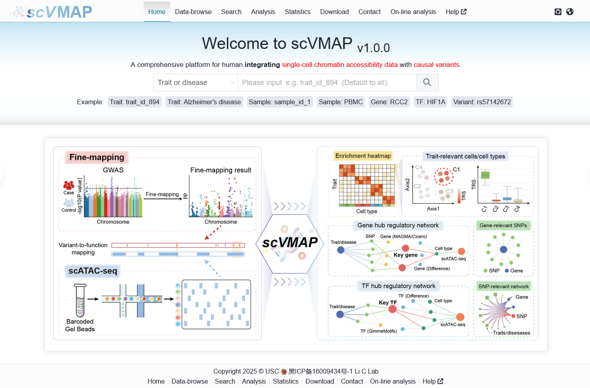
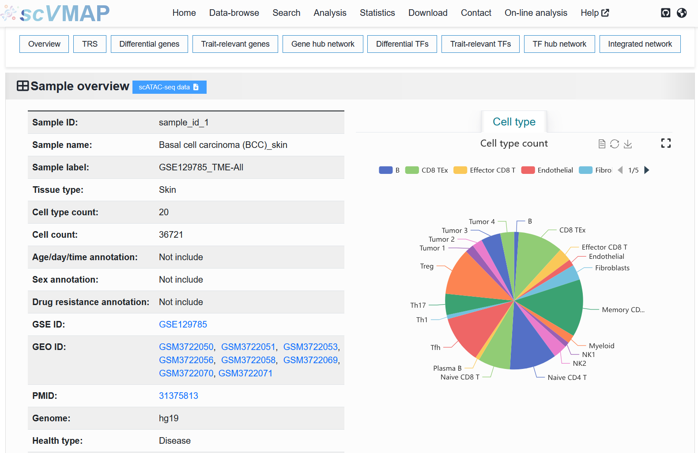
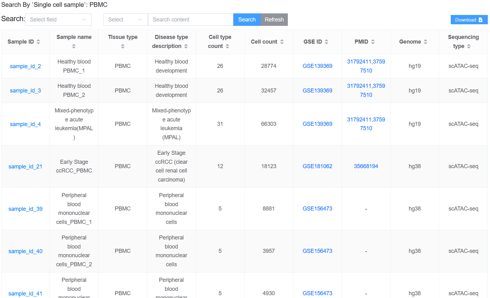

3.1 Home
============

On the homepage, we support **simple** searches for ``traits or disease(s)``
of interest and ``single-cell sample(s)`` of interest. It is evident
that this feature allows users to search for desired results based
on the input of these two types of data, following **certain principles**
(which will be explained below).

Search principle
--------------------

 | Here, we provide four examples corresponding to two types of input for different search conditions.

1. ``Trait or disease`` search:
***********************************

:Input Type 1: When a user enters a **Trait or disease ID** (e.g., ``trait_id_1496``), the system directs to the detailed page (`https://bio.liclab.net/scvdb/detail?traitId=trait_id_1 <https://bio.liclab.net/scvdb/detail?traitId=trait_id_1>`_) of the corresponding causal variant effect data.

.. image:: ../img/home/traitById.png

:Input Type 2: Upon entering a trait or disease name (e.g., ``Alzheimer's disease``), the user is presented with a table listing relevant results (`https://bio.liclab.net/scvdb/simple_search?title=trait&value=Alzheimer's+disease <https://bio.liclab.net/scvdb/simple_search?title=trait&value=Alzheimer's+disease>`_). This list is derived from a fuzzy search conducted on the input term using columns ``Trait abbreviation`` and ``Trait Description`` from the ``Trait or disease data`` tab on the `Data-Browse <https://bio.liclab.net/scvdb/data_browse>`_ page, ensuring comprehensive and relevant matches.

.. image:: ../img/home/traitByAlzheimer.png

.. note::

    Here, if the fuzzy search encounters the word "disease", it will be ignored in the search.

2. ``Single cell sample`` search:
***********************************

:Input Type 1: When a user enters a **Sample ID** (e.g., ``sample_id_1``), the system directs to the detailed page (`https://bio.liclab.net/scvdb/detail?detail?sampleId=sample_id_1 <https://bio.liclab.net/scvdb/detail?detail?sampleId=sample_id_1>`_) of the corresponding causal variant effect data.

:Input Type 2: Upon entering a trait or disease name (e.g., ``PBMC``), the user is presented with a table listing relevant results (`https://bio.liclab.net/scvdb/simple_search?title=sample&value=PBMC <https://bio.liclab.net/scvdb/simple_search?title=sample&value=PBMC>`_). This list is derived from a fuzzy search conducted on the input term using columns ``Tissue type`` and ``Health type Description`` from the ``Single cell chromatin accessibility data`` tab on the `Data-Browse <https://bio.liclab.net/scvdb/data_browse>`_ page, ensuring comprehensive and relevant matches.

