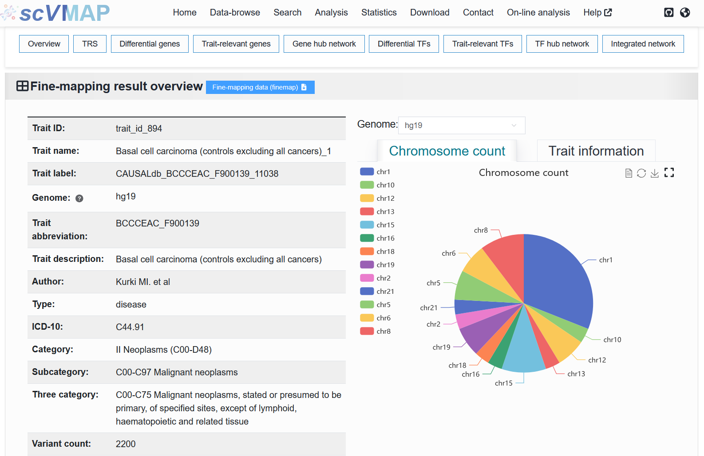
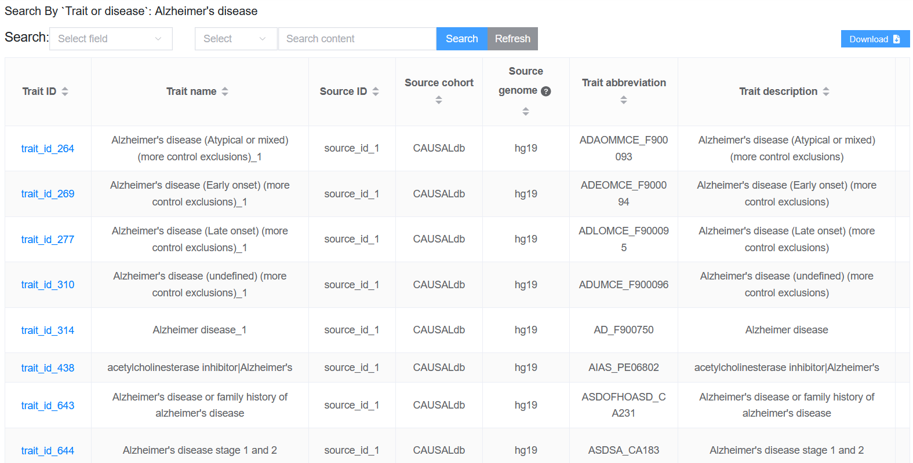
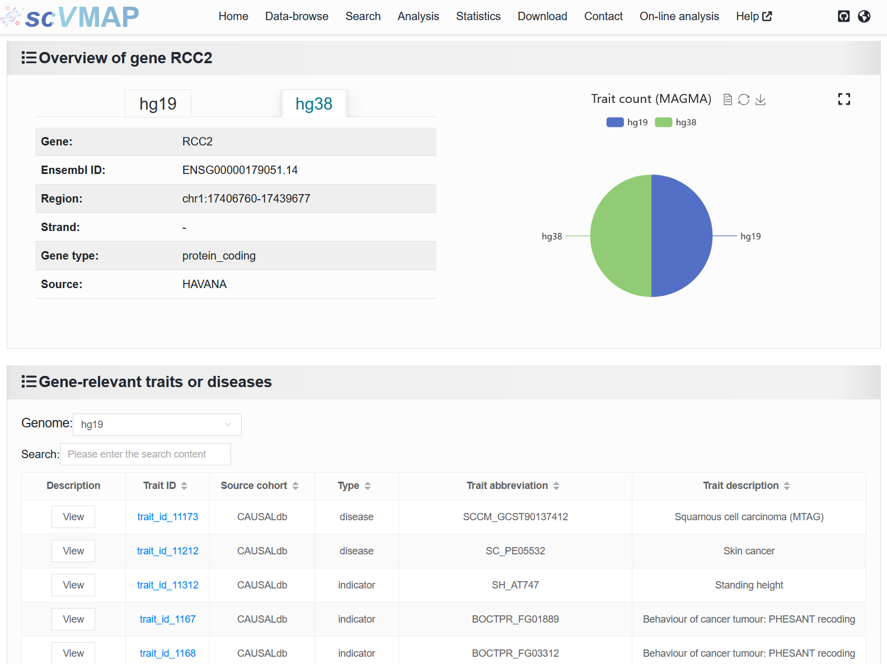

2.1 Home
============

 | Link: https://bio.liclab.net/scvmap/

On the homepage, we provide an intuitive and concise interface, and support **simple** searches.

.. image:: ../img/home/home.png

--------------------

Search principle:

 | Here, we provide five search contents corresponding to the five search functions on the "`Search <http://bio.liclab.net/search>`_" page.

2.1.1 ``Trait or disease`` search
^^^^^^^^^^^^^^^^^^^^^^^^^^^^^^^^^^^

:Input Type 1: When a user enters a **Trait or disease ID** (e.g., ``trait_id_894``), the system directs to the detailed page (`https://bio.liclab.net/scvmap/detail?traitId=trait_id_1 <https://bio.liclab.net/scvmap/detail?traitId=trait_id_1>`_) of the corresponding causal variant effect data.

:Input Type 2: Upon entering a trait or disease name (e.g., ``Alzheimer's disease``), the user is presented with a table listing relevant results (`https://bio.liclab.net/scvmap/simple_search?title=trait&value=Alzheimer's+disease <https://bio.liclab.net/scvmap/simple_search?title=trait&value=Alzheimer's+disease>`_). This list is derived from a fuzzy search conducted on the input term using columns ``Trait abbreviation`` and ``Trait description`` from the ``Trait or disease data`` tab on the `Data-browse <https://bio.liclab.net/scvmap/data_browse>`_ page, ensuring comprehensive and relevant matches.

Clicking on the ``Trait ID`` will take you to the corresponding detail page to view detailed content.
Help document for users to view detail pages: `https://scvmap-tutorial.readthedocs.io/en/latest/usage/detail.html <https://scvmap-tutorial.readthedocs.io/en/latest/usage/detail.html>`_

.. tip::

    When the search field is empty, clicking the search button will return data for all traits and diseases.

.. note::

    Here, if the fuzzy search encounters the word "disease", it will be ignored in the search. And it has a slightly different retrieval process from the corresponding function of "Search information by category or source cohort" on the "`Search <http://bio.liclab.net/search>`_" page, but the retrieval results are the same.

2.1.2 ``Single cell sample`` search
^^^^^^^^^^^^^^^^^^^^^^^^^^^^^^^^^^^

:Input Type 1: When a user enters a **Sample ID** (e.g., ``sample_id_1``), the system directs to the detailed page (`https://bio.liclab.net/scvmap/detail?detail?sampleId=sample_id_1 <https://bio.liclab.net/scvmap/detail?detail?sampleId=sample_id_1>`_) of the corresponding causal variant effect data.

.. image:: ../img/home/sampleById.png

:Input Type 2: Upon entering a trait or disease name (e.g., ``PBMC``), the user is presented with a table listing relevant results (`https://bio.liclab.net/scvmap/simple_search?title=sample&value=PBMC <https://bio.liclab.net/scvmap/simple_search?title=sample&value=PBMC>`_). This list is derived from a fuzzy search conducted on the input term using columns ``Tissue type`` and ``Health type description`` from the ``Single cell chromatin accessibility data`` tab on the `Data-browse <https://bio.liclab.net/scvmap/data_browse>`_ page, ensuring comprehensive and relevant matches. In addition, it also supports fuzzy search of the "Sample label" field in the `detail <https://bio.liclab.net/scvmap/detail?detail?sampleId=sample_id_1>`_ page.

.. image:: ../img/home/sampleByPBMC.png

Clicking on the ``Sample ID`` will take you to the corresponding detail page to view detailed content.
Help document for users to view detail pages: `https://scvmap-tutorial.readthedocs.io/en/latest/usage/detail.html <https://scvmap-tutorial.readthedocs.io/en/latest/usage/detail.html>`_

.. tip::

    When the search field is empty, clicking the search button will return data for all scATAC-seq samples.

.. note::

    It has a slightly different retrieval process from the corresponding function of "Search for information by tissue type or cell type" on the "`Search <http://bio.liclab.net/search>`_" page, but the retrieval results are the same.

2.1.3 ``Gene`` search
^^^^^^^^^^^^^^^^^^^^^^^^^^^^^^^^^^^

When a user enters a **gene** (e.g., ``RCC2``), the system directs to the detailed page (`http://bio.liclab.net/gene_detail?gene=RCC2 <http://bio.liclab.net/gene_detail?gene=RCC2>`_) of the gene.

Help document for users to view gene details page: `https://scvmap-tutorial.readthedocs.io/en/latest/usage/search/gene.html <https://scvmap-tutorial.readthedocs.io/en/latest/usage/search/gene.html>`_

.. note::

    It is completely consistent with the retrieval process and results of the "Search information by gene" function on the "`Search <http://bio.liclab.net/search>`_" page.

2.1.4 ``TF`` search
^^^^^^^^^^^^^^^^^^^^^^^^^^^^^^^^^^^

When a user enters a **TF** (e.g., ``HIF1A``), the system directs to the detailed page (`http://bio.liclab.net/tf_detail?tf=HIF1A <http://bio.liclab.net/tf_detail?tf=HIF1A>`_) of the TF.

Help document for users to view TF details page: `https://scvmap-tutorial.readthedocs.io/en/latest/usage/search/tf.html <https://scvmap-tutorial.readthedocs.io/en/latest/usage/search/tf.html>`_

.. note::

    It is completely consistent with the retrieval process and results of the "Search information by TF" function on the "`Search <http://bio.liclab.net/search>`_" page.

2.1.5 ``Variant`` search
^^^^^^^^^^^^^^^^^^^^^^^^^^^^^^^^^^^

When a user enters a **rsID** (e.g., ``rs57142672``), the system directs to the detailed page (`http://bio.liclab.net/variant_detail?variant=rs57142672 <http://bio.liclab.net/variant_detail?variant=rs57142672>`_) of the causal variant.

.. image:: ../img/home/variant.png

Help document for users to view variant details page: `https://scvmap-tutorial.readthedocs.io/en/latest/usage/search/variant.html <https://scvmap-tutorial.readthedocs.io/en/latest/usage/search/variant.html>`_

.. note::

    It is completely consistent with the retrieval process and results of the "Search information by SNP" function on the "`Search <http://bio.liclab.net/search>`_" page.
