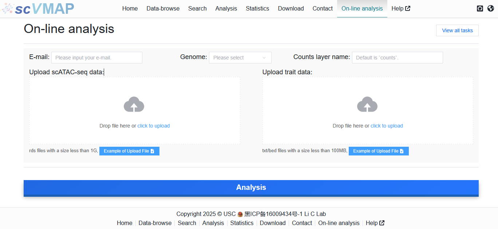
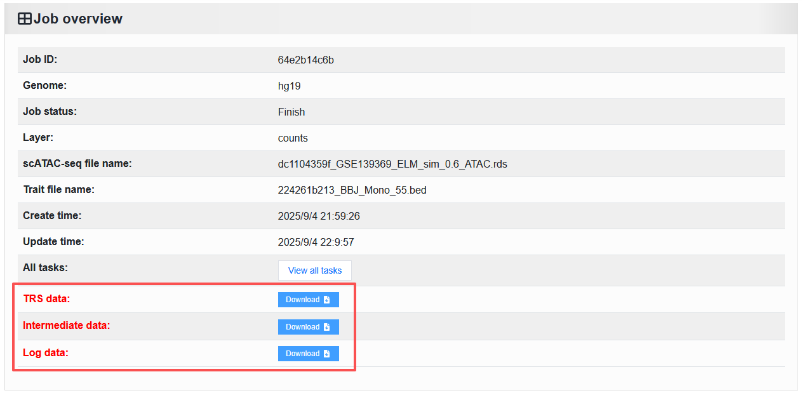
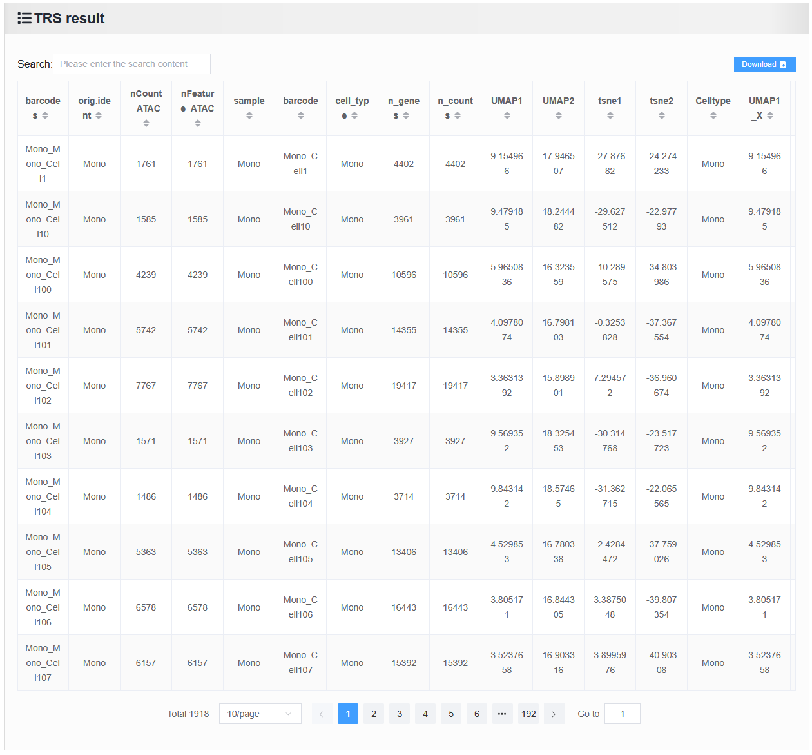
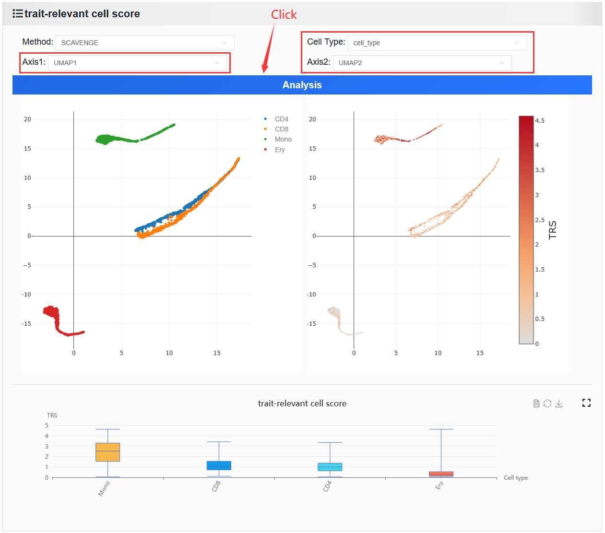

2.9 On-line analysis
=====================

 | Link: https://bio.liclab.net/scvmap/on_line

The scVMAP platform supports users in uploading their own data for TRS analysis.

Example data can be downloaded for reference by clicking the ``Example of Upload File button``.

Parameter Description:

1. ``E-mail``: Users provide their email address to receive notifications when a run starts and ends.
#. ``Genome``: Reference genome for the run data.
#. ``Counts layer name``: The layer name for the counts matrix in the RDS file. The default is ``counts``.
#. ``Upload scATAC-seq data``: For uploaded scATAC-seq data, only the RDS file format is supported.
#. ``Upload trait data``: For uploaded trait data, only BED and TXT file formats are supported.

The specific process is as follows:

Typically, the ``On-line analyse`` take a while to complete. Therefore, we have implemented friendly email notifications to alert you when an analysis starts and when it finishes.
For each submission, we provide users with a job ID (e.g., ``64e2b14c6b``), which can be used to check the running status at any time via the URL `https://bio.liclab.net/scvmap/job_detail?jobId=64e2b14c6b <https://bio.liclab.net/scvmap/job_detail?jobId=64e2b14c6b>`_.
When the analysis is completed, the webpage will provide the following information:

1. Running result data: This mainly includes TRS results, as well as intermediate data generated during the algorithm execution process, such as counts matrix, M-kNN data, etc. Additionally, it also contains log information generated during the running process, which helps users understand and review the analysis. These three files can be downloaded by clicking the ``Download`` button.

2. Table data of TRS results.

3. Online analysis results function: Displays the visualization of trait-enriched cell populations. This function requires users to select the dimension coordinates and cell type columns to be displayed in the cell annotation plot based on their uploaded scATAC-seq data.

