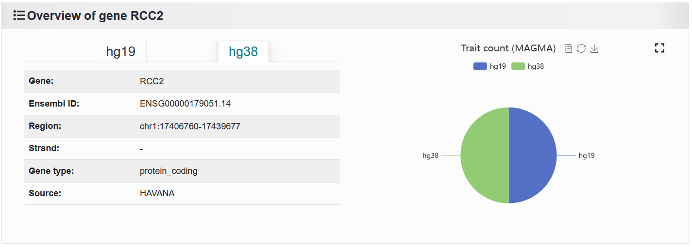

2.3.3  Search information by gene
=================================

 | Link: https://bio.liclab.net/scvdb/search

Users can submit a gene of interest search to access scATAC-seq data and fine-mapping result data associated with this gene.

.. image:: ../../img/search/gene/gene.png

The results are divided into four parts, as follows:

1. Gene details and number of traits enriched by genes under different reference genome backgrounds.

2. It shows the traits or diseases enriched in this gene by MAGMA.

.. image:: ../../img/search/gene/gene_trait.png

Click the 'View' button to see the details of a trait or disease associated with this gene.

.. image:: ../../img/search/gene/gene_trait_view1.png

.. image:: ../../img/search/gene/gene_trait_view2.png

3. Display the content of the gene annotation and ten annotation topics by overlapping.

.. image:: ../../img/search/gene/gene_regulation.png

4. Displays the samples containing genes that are different from cell types in single cell samples.

.. image:: ../../img/search/gene/gene_sample.png

.. note::

    The scATAC-seq sample data of associated genes is the most relaxed standard, without any strict threshold. Specific information needs to be accessed by clicking on the ``Sample ID`` to enter the "Detail" page.
