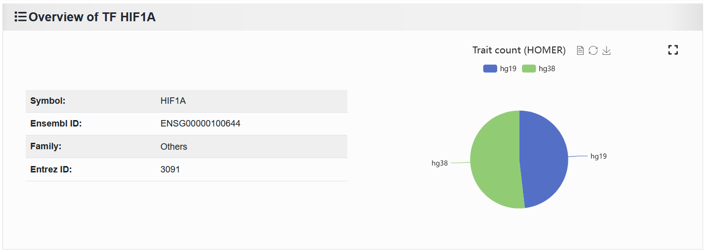

2.3.4 Search information by TF
==============================

 | Link: https://bio.liclab.net/scvdb/search

Users can submit a TF of interest search to access scATAC-seq data and fine-mapping result data associated with this TF.

.. image:: ../../img/search/tf/tf.png

The results are divided into three parts, as follows:

1. TF details and number of traits enriched by TFs under different reference genome backgrounds.

2. It shows the traits or diseases enriched in this TF by HOMER.

.. image:: ../../img/search/tf/tf_trait.png

Click the 'View' button to see the details of a trait or disease associated with this TF.

.. image:: ../../img/search/tf/tf_trait_view.png

Click the button on the link to get the result of HOMER motif enrichment running. (The first column in the table.)

.. image:: ../../img/search/tf/tf_trait_link.png

.. note::

    Due to the fact that there may be too few causal variants in some trait or disease data, motif enrichment may not occur, so a very small portion may not have linking results.

3. Displays the samples containing TFs that are different from cell types in single cell samples.

.. image:: ../../img/search/tf/tf_sample.png

.. note::

    The scATAC-seq sample data of associated TFs is the most relaxed standard, without any strict threshold. Specific information needs to be accessed by clicking on the ``Sample ID`` to enter the "Detail" page.
