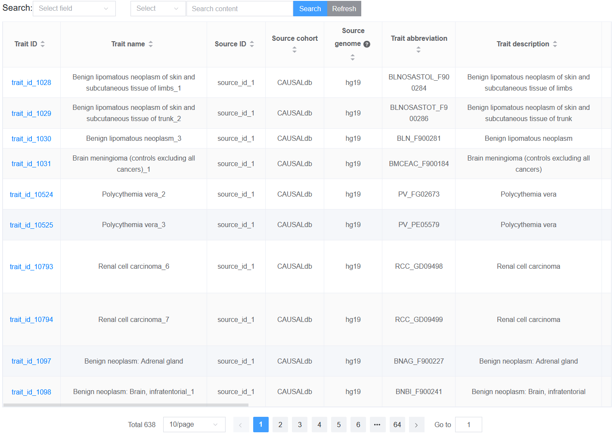
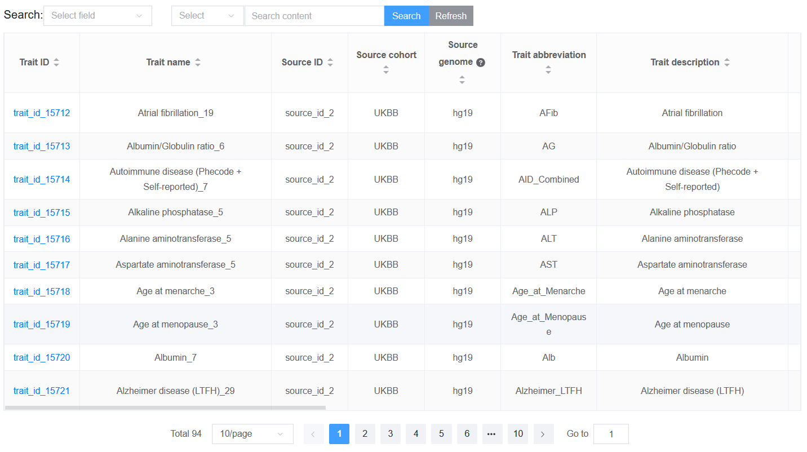

2.3.1 Search information by category or source cohort
=====================================================

 | Link: https://bio.liclab.net/scvmap/search

We provide two strategies for searching fine-mapping result data, one is to search by category, and the other is to search by data source, which can be switched between the "Source cohort" and "Category buttons". The pie chart on the right will display the corresponding distribution information of the selected strategy.

2.3.1.1 Category
^^^^^^^^^^^^^^^^^^^^^^^^^^^^^^^^^^^^^^^

.. image:: ../../img/search/trait/trait_category.png

Click "Search" to access the fine-mapping result data based on the search criteria.

.. note::

    The selection box supports input prompts, and on the right side, you can click the cross to clear the input content.

.. note::

    The table displaying the result information is much richer than page `Data-browse <https://bio.liclab.net/scvmap/data_browse>`_.

2.3.1.2 Source cohort
^^^^^^^^^^^^^^^^^^^^^^^^^^^^^^^^^^^^^^^

Click the switch button to switch strategies.

.. image:: ../../img/search/trait/trait_source.png

Click "Search" to access the fine-mapping result data based on the search criteria.

