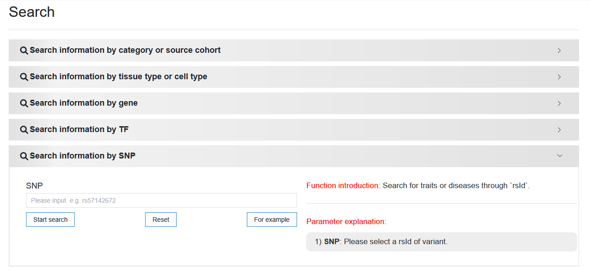
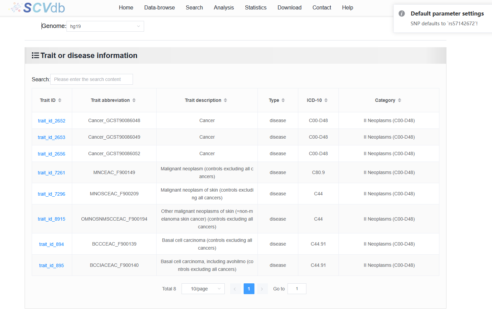
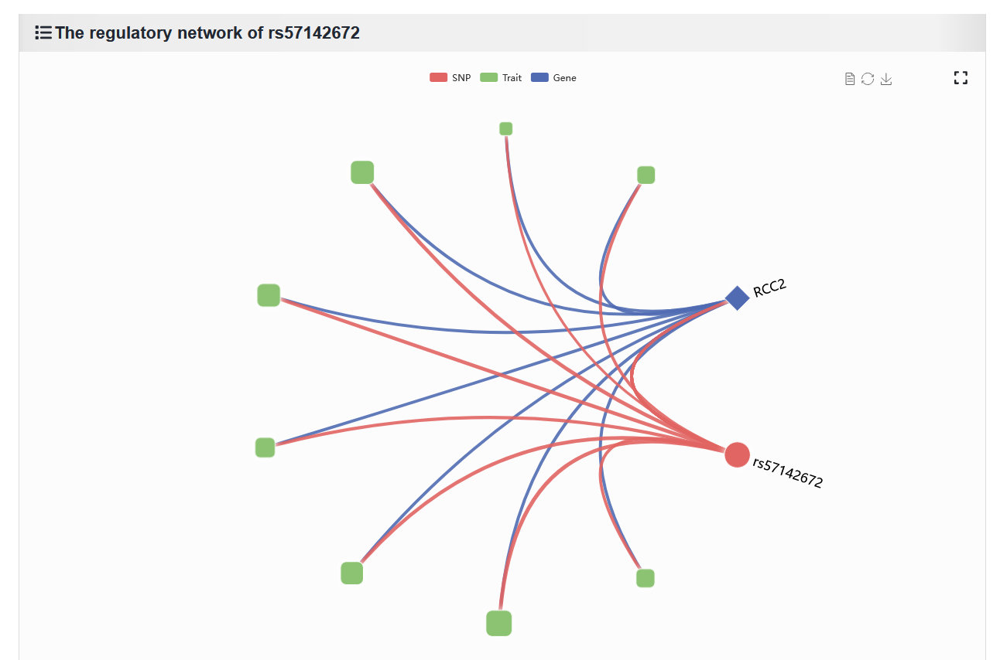

2.3.5 Search information by SNP
===============================

 | Link: https://bio.liclab.net/scvdb/search

Users can submit SNP (rsID) searches of interest to access trait or disease data related to this SNP, and the SNP-relevant regulatory network.

The results are divided into two parts, as follows:

1. Data on all traits or diseases containing the SNP (causal variant).

2. Visualize the SNP-relevant regulatory network.

.. note::

    The thickness of the line between SNP and trait or disease, as well as the size of the trait, represent the PP value of this SNP in the trait or disease. The thickness of lines related to genes has no meaning.
