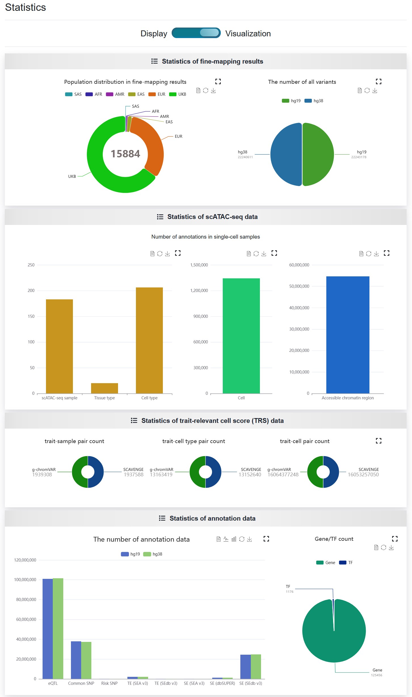
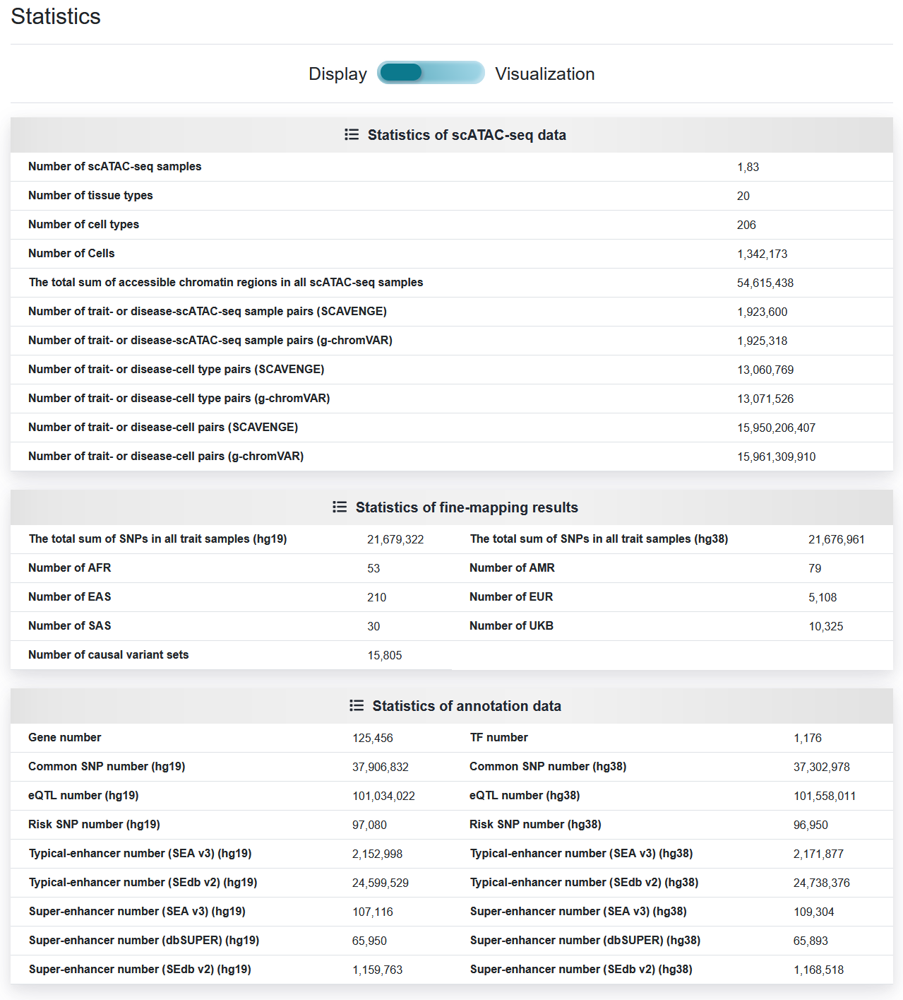

2.6 Statistics
================

 | Link: https://bio.liclab.net/scvdb/statistics

Statistical analysis of data used in the construction of SCVdb analysis platform.

SCVdb offers two viewing approaches, namely ``Display`` and ``Visualization``.

2.6.1 Visualization
^^^^^^^^^^^^^^^^^^^^^

2.6.2 Display
^^^^^^^^^^^^^^^^^^^^^

