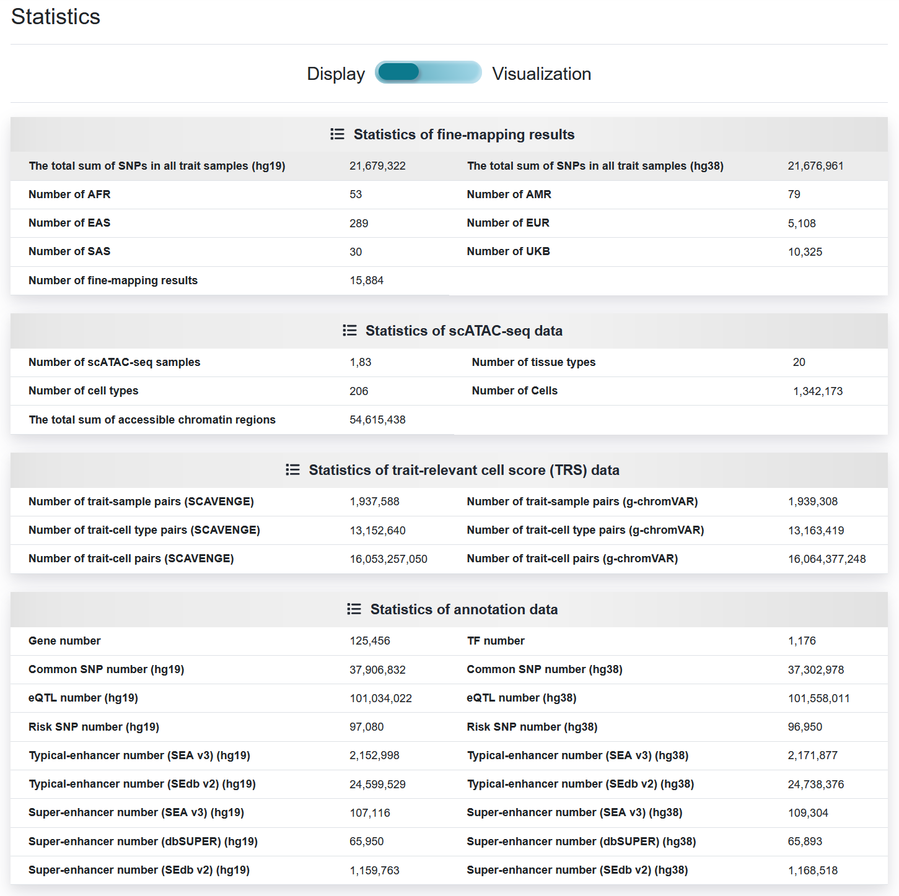

2.6 Statistics
================

 | Link: https://bio.liclab.net/scvmap/statistics

Statistical analysis of data used in the construction of scVMAP analysis platform.

scVMAP offers two viewing approaches, namely ``Display`` and ``Visualization``.

2.6.1 Visualization
^^^^^^^^^^^^^^^^^^^^^

2.6.2 Display
^^^^^^^^^^^^^^^^^^^^^

